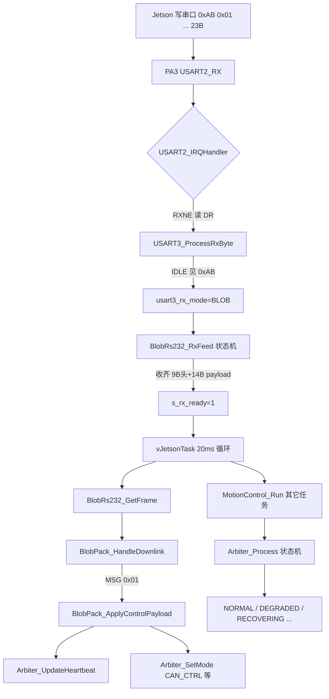
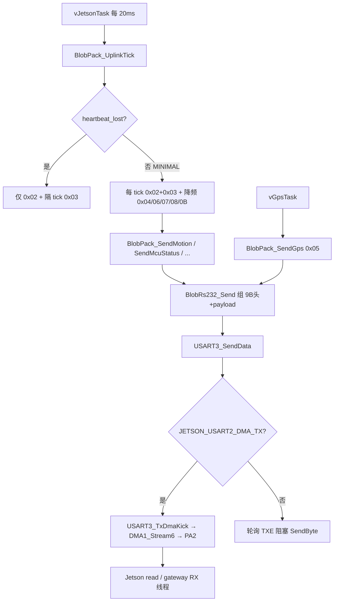

# Jetson 与 MCU BLOB 二进制协议（v2.0 草案）

| 元数据 | 值 |
|--------|-----|
| **协议版本** | **v2.0-draft.5.12** |
| **文档日期** | 2026-06-18 |
| **物理层** | RS232 115200 8N1（USART2）或 CAN2 500 kbps（编译期二选一） |
| **编码** | 多字节整数 **大端 BE**；`#pragma pack(1)` |

> **横排表约定**：与 [Jetson_RS232协议.md](./Jetson_RS232协议.md) 相同——首列留空；多字节范围写 `4-5`（ASCII 连字符，勿用 `~` 防删除线）；**分隔行 `|:---:` 个数必须与列数一致**。

> **与 V3 的关系**：BLOB **PAYLOAD（struct）** 为 v2 新定义；**传输层**沿用 V3 思路——**同一条线格式**，RS232 整帧发送，CAN 按 ID 8 字节顺序分片。时间同步等 **0xA5 / 0x107~0x108 服务帧保持不变**，与 BLOB 混传。

硬件切换见 [硬件连接与通信协议.md](./硬件连接与通信协议.md) **§2.2**（`JETSON_LINK_CAN` 1=CAN2，0=USART2）。

---

## 0. 传输封装（所有 BLOB 业务帧共用）

### 0.1 线格式（Wire Image）

RS232 与 CAN **共用同一字节序列**：先 9 字节头，再 `LEN` 字节 PAYLOAD。

```text
[0xAB][VER=0x01][MSG_ID][SEQ][LEN_H][LEN_L][FRAG_IDX][FRAG_CNT][FLAGS][PAYLOAD...]
```

| | 0 | 1 | 2 | 3 | 4-5 | 6 | 7 | 8 | 9+ |
|:---:|:---:|:---:|:---:|:---:|:---:|:---:|:---:|:---:|:---:|
| **字段** | MAGIC | VER | MSG_ID | SEQ | LEN | FRAG_IDX | FRAG_CNT | FLAGS | PAYLOAD |
| **类型** | u8 | u8 | u8 | u8 | u16 BE | u8 | u8 | u8 | struct |
| **说明** | 0xAB | 0x01 | 消息类型 | 0-255 | PAYLOAD字节数 | 固定0 | CAN分片数 | 填0 | 见各章 |

- **线长** = `9 + LEN`（例：agv_control_t → 9+14=**23 B**）
- **LEN** 仅计 PAYLOAD，不含 9 字节头
- RS232 单帧：`FRAG_IDX=0`，`FRAG_CNT=1`
- CAN 多片：发送前设 `FRAG_CNT = ceil(线长 / 8)`，`FRAG_IDX` 仍为 0（分片顺序靠 CAN 帧到达次序，同 V3）

### 0.2 RS232 模式（`JETSON_LINK_CAN=0`）

字节流 **混传**，首字节魔数分支（与现有 V3 并存）：

| 魔数 | 线长 | 用途 | 文档 |
|:----:|:----:|------|------|
| **0xAA** | 24 B | 旧 V3 应用帧 | [Jetson_RS232协议.md](./Jetson_RS232协议.md) |
| **0xA5** | 11 B | 服务帧（时间同步/GPS/故障等） | 同上 §8 |
| **0xAB** | **9+LEN** | **BLOB v2**（本协议） | 本文 |

> **MCU 收包优先级（`JETSON_USE_BLOB_V2=1`）**：IDLE 下 **0xAB → 0xA5**，**忽略 0xAA**（防 BLOB payload 误同步进 V3）。对比 V3 下行需 Jetson `use_blob_v2:=false` 且 MCU 启用 V3 分支。详见 **附录 C §C.9**。

**0xAB 收包状态机**（与 V3 收 0xAA 类似）：

1. 读到 **0xAB** → 再收 **8** 字节（凑齐 9 字节头）
2. 从 byte4-5 解析 **LEN**
3. 再收 **LEN** 字节 PAYLOAD
4. 按 **MSG_ID** 解 struct

| 项目 | 约定 |
|------|------|
| 物理 | USART2，PA2=TX / PA3=RX，115200 8N1 |
| 发送 | 整段 `[9B头][PAYLOAD]` **一次写出**，无额外 XOR |
| 周期 | 见 **§0.4** |

### 0.3 CAN 模式（`JETSON_LINK_CAN=1`）

与 V3 的 **3×8 分片** 相同规则，只是线长可变：

1. 内存组装完整线格式 `wire[0 .. 9+LEN-1]`
2. 设 `wire[7] = FRAG_CNT = ceil((9+LEN) / 8)`
3. 选 **CAN ID** = `0x180 + MSG_ID`（见下表）
4. 按顺序发 `ceil(线长/8)` 帧，每帧 **8 B**；末帧不足补 **0x00**
5. 接收端同 ID 顺序拼接后，再按 **§0.1** 解析

| MSG_ID | CAN ID | 方向 | struct | PAYLOAD | 线长 | CAN帧数 |
|:--:|:--:|:----:|--------|:--:|:--:|:--:|
| **0x01** | **0x181** | Jetson->MCU | agv_control_t | 14 B | 23 B | 3 |
| **0x02** | **0x182** | MCU->Jetson | agv_motion_t | 40 B | 49 B | 7 |
| **0x03** | **0x183** | MCU->Jetson | mcu_status_t | 42 B | 51 B | 7 |
| **0x04** | **0x184** | MCU->Jetson | sensor_blob_t | 28 B | 37 B | 5 |
| **0x05** | **0x185** | MCU->Jetson | gps_compact_t | 32 B | 41 B | 6 |
| **0x06** | **0x186** | MCU->Jetson | agv_motor04_t | 44 B | 53 B | 7 |
| **0x07** | **0x187** | MCU->Jetson | agv_motor58_t | 44 B | 53 B | 7 |
| **0x08** | **0x188** | MCU->Jetson | agv_energy_t | 41 B | 50 B | 7 |
| **0x0B** | **0x18B** | MCU->Jetson | agv_motor_pos_t | 36 B | 45 B | 6 |
| **0x10** | **0x190** | Jetson->MCU | sensor_cfg_t | 8 B | 17 B | 3 |
| **0x11** | **0x191** | Jetson->MCU | local_goal_t | 22 B | 31 B | 4 |
| **0x12** | **0x192** | MCU->Jetson | nav_feedback_t | 28 B | 37 B | 5 |

> **0x107~0x10B**（时间同步/故障/状态查询）仍走 [Jetson_CAN协议.md](./Jetson_CAN协议.md) 原定义，**不**包在 0xAB 头里。

**CAN 分片示例**（MSG 0x01，线长 23 B → 3 帧，ID=0x181）：

| CAN序号 | byte0-7（线格式偏移） |
|:--:|------|
| 0 | `[0xAB][0x01][0x01][SEQ][0x00][0x0E][0x00][0x03]` |
| 1 | `[0x00][PAYLOAD 0-6]` |
| 2 | `[PAYLOAD 7-13][0x00][0x00]`（末帧补 0） |

### 0.4 建议通信周期

| 数据 | MSG | 周期 |
|------|:---:|:--:|
| Jetson 控制 | 0x01 | **≤20 ms**（**所有 nav_mode 下均须发**，见 **§5.3**） |
| 局部目标 | 0x11 | **50 ms**（`LOCAL_NAV`）；`DIRECT` 时 **≥1 s** 保活即可 |
| 导航反馈 | 0x12 | **20 ms**（阶段 0 可先填 `IDLE`） |
| 运动摘要 | 0x02 | **20 ms** |
| 电机 0-3 / 4-7 | 0x06 / 0x07 | 各 **40 ms**（交替） |
| 能源/里程 | 0x08 | **100 ms** |
| GPS | 0x05 | **100 ms** |
| 四路超声 | 0x04 | **20 ms** |
| MCU 状态 | 0x03 | **50 ms** |
| 全脉冲 | 0x0B | **1 Hz**（可选） |
| 时间同步 | 0xA5/0x107 | **10 s**（不变） |

---

## MSG_ID 总览

| MSG_ID | 类别 | 方向 | struct | PAYLOAD |
|:--:|------|:----:|--------|:--:|
| **0x01** | 底盘 | Jetson->MCU | agv_control_t | 14 B |
| **0x02** | 底盘 | MCU->Jetson | agv_motion_t | 40 B |
| **0x06** | 底盘 | MCU->Jetson | agv_motor04_t | 44 B |
| **0x07** | 底盘 | MCU->Jetson | agv_motor58_t | 44 B |
| **0x08** | 底盘 | MCU->Jetson | agv_energy_t | 41 B |
| **0x0B** | 底盘 | MCU->Jetson | agv_motor_pos_t | 36 B |
| **0x05** | GPS | MCU->Jetson | gps_compact_t | 32 B |
| **0x04** | 传感器 | MCU->Jetson | sensor_blob_t | 28 B |
| **0x10** | 传感器 | Jetson->MCU | sensor_cfg_t | 8 B |
| **0x03** | MCU | MCU->Jetson | mcu_status_t | 42 B |
| **0x11** | 导航 | Jetson->MCU | local_goal_t | 22 B |
| **0x12** | 导航 | MCU->Jetson | nav_feedback_t | 28 B |

**帧 stamp**：每个 struct **byte 0-3 = timestamp_ms（u32 BE）**，必须有。

---

## 1. 底盘

### 1.1 控制 agv_control_t（MSG 0x01，14 B）

| | 0-3 | 4-5 | 6-7 | 8-9 | 10 | 11 | 12 | 13 |
|:---:|:---:|:---:|:---:|:---:|:---:|:---:|:---:|:---:|
| **字段** | timestamp_ms | linear_vel | angular_vel | steer_angle | control_mode | motion_drive_info | clear_fault | light_info |
| **类型** | u32 BE | s16 BE | s16 BE | s16 BE | u8 | u8 | u8 | u8 |
| **说明** | 帧时刻 | 线速度mm/s | 角速度0.001rad/s | 转角0.001rad | 0待机1CAN | 运动+驱动模式 | 清错码 | 灯光 |

### 1.2 运动 agv_motion_t（MSG 0x02，40 B）

| | 0-3 | 4 | 5 | 6 | 7-10 | 11-12 | 13-18 | 19-26 | 27-34 | 35-39 |
|:---:|:---:|:---:|:---:|:---:|:---:|:---:|:---:|:---:|:---:|:---:|
| **字段** | timestamp_ms | system_info | motion_info | light_pack | fault_code | bat_v | vel_x3 | wheel_angle_x4 | wheel_speed_x4 | rsv |
| **类型** | u32 BE | u8 | u8 | u8 | u32 BE | u16 BE | s16x3 BE | s16x4 BE | s16x4 BE | u8x5 |
| **说明** | 帧时刻 | 系统状态 | 运动模式 | 灯光+计数 | 0x211故障 | 电压0.1V | 线角转 | 四轮角 | 四轮速 | 填0 |

### 1.3 电机 agv_motor04_t / agv_motor58_t（MSG 0x06/0x07，44 B）

| | 0-3 | 4-13 | 14-23 | 24-33 | 34-43 |
|:---:|:---:|:---:|:---:|:---:|:---:|
| **字段** | timestamp_ms | motor0 | motor1 | motor2 | motor3 |
| **说明** | 帧时刻 | 10B紧凑体 | 10B | 10B | 10B |

motor 10B：`speed s16 | current s16 | voltage u16 | temp i8 | driver_status u8 | position_lo u16`

### 1.4 能源 agv_energy_t（MSG 0x08，41 B）

| | 0-3 | 4-19 | 20-33 | 34-40 |
|:---:|:---:|:---:|:---:|:---:|
| **字段** | timestamp_ms | odom_x4 | bms | remote_x7 |
| **说明** | 帧时刻 | 四轮里程s32 | 14B BMS | 7B遥控 |

---

## 2. GPS

### 2.1 gps_compact_t（MSG 0x05，32 B）

| | 0-3 | 4 | 5 | 6-7 | 8-9 | 10-13 | 14-17 | 18-19 | 20-21 | 22-25 | 26-31 |
|:---:|:---:|:---:|:---:|:---:|:---:|:---:|:---:|:---:|:---:|:---:|:---:|
| **字段** | timestamp_ms | flags | num_sv | hdop_x100 | speed_cms | lat_e7 | lon_e7 | heading_x100 | alt_dm | utc_sec | rsv |
| **类型** | u32 BE | u8 | u8 | u16 BE | u16 BE | s32 BE | s32 BE | s16 BE | s16 BE | u32 BE | u8x6 |
| **说明** | 帧时刻 | 定位标志 | 卫星数 | HDOPx100 | cm/s | 纬度e7 | 经度e7 | 航向x100 | 海拔dm | UTC秒 | 填0 |

#### flags（byte 4）

| Bit | 名称 | =1 |
|:--:|------|-----|
| 0 | POS_VALID | 位置有效 |
| 1 | VEL_VALID | 速度有效 |
| 2 | HEADING_VALID | 航向有效 |
| 3 | FIX_3D_LIKE | fix有效 |
| 4 | USEFULL | NMEA有效 |
| 5-7 | RSV | 0 |

| 字段 | 无效值 |
|------|--------|
| hdop_x100 | 0xFFFF |
| alt_dm | 0x7FFF |
| utc_sec | 无GPS填0 |

---

## 3. 传感器

### 3.1 sensor_blob_t（MSG 0x04，28 B）

| | 0-3 | 4-5 | 6-7 | 8-9 | 10-11 | 12-15 | 16-19 | 20-23 | 24-27 |
|:---:|:---:|:---:|:---:|:---:|:---:|:---:|:---:|:---:|:---:|
| **字段** | timestamp_ms | dist_f | dist_b | dist_l | dist_r | stamp_f | stamp_b | stamp_l | stamp_r |
| **类型** | u32 BE | u16 BE | u16 BE | u16 BE | u16 BE | u32 BE | u32 BE | u32 BE | u32 BE |
| **说明** | 帧时刻 | 前mm | 后mm | 左mm | 右mm | 前stamp | 后stamp | 左stamp | 右stamp |

dist 无效 **0xFFFF**；有效 0-60000 mm。stamp = 该路 stable_mm 最后变化 tick。

### 3.2 sensor_cfg_t（MSG 0x10，8 B）

| | 0-3 | 4-5 | 6 | 7 |
|:---:|:---:|:---:|:---:|:---:|
| **字段** | timestamp_ms | threshold_mm | enable_mask | rsv |
| **类型** | u32 BE | u16 BE | u8 | u8 |
| **说明** | 帧时刻 | 避障阈值mm | bit0-3四路使能 | 0 |

---

## 4. MCU

### 4.1 mcu_status_t（MSG 0x03，42 B）

| | 0-3 | 4 | 5 | 6 | 7 | 8-13 | 14-21 | 22-37 | 38-39 | 40 | 41 |
|:---:|:---:|:---:|:---:|:---:|:---:|:---:|:---:|:---:|:---:|:---:|:---:|
| **字段** | timestamp_ms | seq | safety | link | limit | arb_vwd | sonar_x4 | stamp_x4 | near | jetson_seq | rsv |
| **类型** | u32 BE | u8 | u8 | u8 | u8 | s16x3 BE | u16x4 BE | u32x4 BE | u16 BE | u8 | u8 |
| **说明** | 帧时刻 | 序号 | 安全态 | 链路 | 限速% | 仲裁速度 | 四向mm | 四向stamp | 最近mm | 控制seq | 0 |

safety：0x01正常 0x02限速 0x03降级 0x04紧急。sonar 同 0x04，Jetson 只订 0x04 即可。

---

## 5. 局部导航（阶段 0：协议骨架）

> **部署路线**：[MCU局部导航DWA部署路线.md](./MCU局部导航DWA部署路线.md) **§7 阶段 0**  
> **原则**：Jetson 全局规划 + sub-goal；MCU 局部规划（Pure Pursuit / DWA）+ 安全仲裁。坐标 **统一车体坐标系 body frame**（x 前、y 左、θ 逆时针为正）。

### 5.1 与现有 MSG 的关系

| MSG | 阶段 0 角色 |
|-----|-------------|
| **0x01** | **始终保留**：链路心跳（`seq`）、`control_mode`、清错/灯光；**速度来源**见 **§5.3** |
| **0x04** | 四路超声 + stamp → 局部规划 `dist()` 代价（阶段 2 起用） |
| **0x02 / 0x03** | 底盘反馈、仲裁态监控（与导航并行） |
| **0x08** | 四轮里程，odom 辅助校正（阶段 1 起用） |
| **0x11** | **新增下行**：导航模式 + body frame 局部目标 |
| **0x12** | **新增上行**：MCU odom + 规划状态回传 |
| **0x107 / 0x108** | 时间同步（与 BLOB 并行，**不变**） |

### 5.2 下行 local_goal_t（MSG 0x11，22 B）

Jetson → MCU。PAYLOAD **22 B**（修正原草案 20 B 缺 `flags` 对齐问题）。

| | 0-3 | 4-7 | 8-11 | 12-13 | 14 | 15 | 16-17 | 18-19 | 20 | 21 |
|:---:|:---:|:---:|:---:|:---:|:---:|:---:|:---:|:---:|:---:|:---:|
| **字段** | timestamp_ms | goal_x_mm | goal_y_mm | goal_theta | nav_mode | seq | max_v | max_omega | hold | flags |
| **类型** | u32 BE | s32 BE | s32 BE | s16 BE | u8 | u8 | s16 BE | s16 BE | u8 | u8 |
| **说明** | 发帧时刻 | 目标 x mm | 目标 y mm | 目标 θ 0.001rad | 模式 | 目标序号 | 限速 mm/s | 角限速 0.001rad/s | 保活 | 标志 |

**坐标系（body frame）**：

| 轴 | 正向 | 单位 |
|----|------|------|
| x | 车头前方 | mm |
| y | 车体左侧 | mm |
| θ | 逆时针 | 0.001 rad（与 0x01 `angular_vel` 同量纲） |

**nav_mode**（byte 14）：

| 值 | 名称 | MCU 行为 |
|:--:|------|----------|
| **0** | DIRECT | 运动指令来自 **0x01** `linear_vel` / `angular_vel`；局部规划器 **不输出** |
| **1** | LOCAL_NAV | 运动指令来自 **局部规划器** `(v,ω)`；**0x01 的 v/ω 忽略**，但仍须发 0x01 心跳 |
| **2** | PAUSE | 强制 `v=0, ω=0`（仲裁层），忽略 0x01 速度与规划器输出 |
| **3** | ESTOP | 等同安全急停；MCU 进入紧急态直至 `nav_mode` 改回且清错 |

**seq**（byte 15）：**独立于 0x01 的 SEQ**，每更新一次目标 +1；MCU 在 **0x12** `seq_echo` 回显。

**限速字段**：

| 字段 | 0 的含义 |
|------|----------|
| max_v_mm_s | 使用 MCU 默认（`ARBITER_MAX_SPEED_MM_S` / 后续 `dwa_config`） |
| max_omega_mrad_s | 使用 MCU 默认角速度上限 |

**hold**（byte 20）：`0x11` **保活超时**。超时未收到新 0x11 → MCU 按 **PAUSE** 处理（减速停车）。  
编码：**`timeout_ms = hold × 50`**；**`hold=0` → 默认 500 ms**（即 10×50）。最大 **12750 ms**（hold=255）。

**flags**（byte 21）：

| Bit | 名称 | =1 |
|:--:|------|-----|
| 0 | GOAL_THETA_VALID | `goal_theta` 参与到达判定 |
| 1-7 | RSV | 填 0 |

**线格式示例**（31 B）：`AB 01 11 SEQ 00 16 00 04 00` + 22B PAYLOAD（CAN ID **0x191**，4 帧）。

### 5.3 模式与 0x01 协同（阶段 0 验收要点）

```text
                    ┌─────────────────────────────────────┐
  0x11 nav_mode     │  DIRECT(0)  → jetson_cmd ← 0x01   │
  ───────────────►  │  LOCAL_NAV  → local_cmd  ← 规划器  │
                    │  PAUSE(2)    → 0 / 0               │
                    │  ESTOP(3)    → 急停                │
                    └─────────────────────────────────────┘
                                      │
                                      ▼
                              Arbiter → CAN 0x111
```

| 规则 | 说明 |
|------|------|
| **0x01 不可停发** | 任意 `nav_mode` 下 Jetson 仍 **≤20 ms** 发 0x01；MCU **300 ms** 无新 0x01 `seq` → `DEGRADED`（与现网一致） |
| **DIRECT 联调** | `nav_mode=0`；仅 0x01 控车；0x11 可 1 Hz 保活；**0x12** 仍周期上报 |
| **LOCAL_NAV** | `nav_mode=1` + 有效 goal；0x01 中 `linear_vel=0, angular_vel=0` 亦可（被忽略） |
| **模式切换** | 收到合法 0x11 **立即生效**；`seq` 变化表示新目标 |
| **上电默认** | MCU 内部 **`nav_mode=DIRECT`**，直至首帧合法 0x11 |

### 5.4 上行 nav_feedback_t（MSG 0x12，28 B）

MCU → Jetson。PAYLOAD **28 B**。

| | 0-3 | 4-7 | 8-11 | 12-13 | 14-15 | 16-17 | 18-19 | 20-21 | 22-23 | 24 | 25 | 26 | 27 |
|:---:|:---:|:---:|:---:|:---:|:---:|:---:|:---:|:---:|:---:|:---:|:---:|:---:|:---:|
| **字段** | timestamp_ms | pose_x | pose_y | pose_theta | cmd_v | cmd_ω | fb_v | fb_ω | goal_dist | plan_st | nav_fb | seq_echo | flags |
| **类型** | u32 BE | s32 BE | s32 BE | s16 BE | s16 BE | s16 BE | s16 BE | s16 BE | u16 BE | u8 | u8 | u8 | u8 |
| **说明** | 帧时刻 | odom x | odom y | odom θ | 规划 v | 规划 ω | 反馈 v | 反馈 ω | 距目标 mm | 状态 | 模式回显 | 0x11 seq | 标志 |

**pose_***：MCU **航迹推算 odom**（上电归零），**不是** GPS/SLAM 全局位姿。单位与 **§5.2** 一致。

**cmd_v / cmd_ω**：局部规划器输出，**仲裁前**（mm/s、0.001 rad/s）。`DIRECT` 或未跑规划时填 **0**。

**fb_v / fb_ω**：底盘实际反馈，来源与 **0x02** `linear_velocity` / `angular_velocity` 一致。

**goal_dist_mm**：到当前 0x11 目标欧氏距离（mm）；无有效目标填 **0xFFFF**。

**plan_status**（byte 24）：

| 值 | 名称 | 含义 |
|:--:|------|------|
| 0 | IDLE | 未启用 `LOCAL_NAV` 或无有效 goal |
| 1 | TRACKING | 正在追踪目标 |
| 2 | REACHED | 到达阈值内（阶段 1 起实现） |
| 3 | BLOCKED | 无可行速度（障碍，阶段 2 起） |
| 4 | FAIL | 规划失败或 0x11 保活超时 |

**nav_mode_fb**：最近一次 **MCU 已接受** 的 0x11 `nav_mode`。

**seq_echo**：最近一次 **MCU 已接受** 的 0x11 `seq`。

**flags**（byte 27）：

| Bit | 名称 | =1 |
|:--:|------|-----|
| 0 | ODOM_VALID | pose 字段有效 |
| 1 | GOAL_ACTIVE | 当前持有未过期 0x11 目标 |
| 2-7 | RSV | 0 |

**线格式示例**（37 B）：`AB 01 12 SEQ 00 1C 00 05 00` + 28B PAYLOAD（CAN ID **0x192**，5 帧）。

阶段 0 实现允许 **固定填** `plan_status=IDLE`、`pose=0`、`nav_mode_fb` 回显即可，用于验证收发链路。

### 5.5 Jetson 侧（阶段 0 最小集）

| 组件 | 动作 |
|------|------|
| `local_goal_bridge` | 周期发 **0x11**（可先 `nav_mode=0` + goal=0 保活） |
| `rs232_gateway` / `eth_gateway` | 解析 **0x12** → ROS topic（如 `/jetson_rs232/nav_feedback`） |
| 现有 **0x01** 发送逻辑 | **不改周期**；DIRECT 模式下仍映射 `cmd_vel` → 0x01 |

**阶段 0 验收**（与部署文档一致）：

- `nav_mode=DIRECT`：仅 0x01 可驱动车辆；
- `0x12` topic 有数据且 `nav_mode_fb` 与下发 0x11 一致；
- `offset_valid` 时间同步（0x107/0x108 或 0xA5）**不受影响**。

---

## 附录 A：C 结构体

```c
#pragma pack(push, 1)

/* 9B BLOB 头（RS232/CAN 共用） */
typedef struct {
    uint8_t  magic;      /* 0xAB */
    uint8_t  ver;        /* 0x01 */
    uint8_t  msg_id;
    uint8_t  seq;
    uint16_t len_be;     /* PAYLOAD 长度，大端 */
    uint8_t  frag_idx;   /* 固定 0 */
    uint8_t  frag_cnt;   /* RS232=1；CAN=ceil((9+len)/8) */
    uint8_t  flags;      /* 0 */
} blob_hdr_t;

typedef struct { /* 0x01, 14B */
    uint32_t timestamp_ms;
    int16_t  linear_vel, angular_vel, steer_angle;
    uint8_t  control_mode, motion_drive_info, clear_fault, light_info;
} agv_control_t;

typedef struct { /* 10B */
    int16_t  speed_rpm, current;
    uint16_t voltage;
    int8_t   temperature;
    uint8_t  driver_status;
    uint16_t position_lo;
} motor_compact_t;

typedef struct { /* 0x02, 40B */
    uint32_t timestamp_ms;
    uint8_t  system_info, motion_info, light_pack;
    uint32_t fault_code;
    uint16_t battery_voltage;
    int16_t  linear_velocity, angular_velocity, steering_angle;
    int16_t  wheel_angle[4], wheel_speed[4];
    uint8_t  rsv[5];
} agv_motion_t;

typedef struct { /* 0x06/0x07, 44B */
    uint32_t timestamp_ms;
    motor_compact_t motor[4];
} agv_motor04_t, agv_motor58_t;

typedef struct { /* 0x08, 41B */
    uint32_t timestamp_ms;
    int32_t  odom[4];
    struct {
        uint8_t bms_soc, bms_soh;
        uint16_t bms_voltage;
        int16_t  bms_current, bms_temperature;
        uint8_t  bms_alarm1, bms_alarm2, bms_warning1, bms_warning2;
    } bms;
    uint8_t remote[7];
} agv_energy_t;

typedef struct { /* 0x05, 32B */
    uint32_t timestamp_ms;
    uint8_t  flags, num_sv;
    uint16_t hdop_x100, speed_cms;
    int32_t  lat_e7, lon_e7;
    int16_t  heading_x100, alt_dm;
    uint32_t utc_sec;
    uint8_t  rsv[6];
} gps_compact_t;

typedef struct { /* 0x04, 28B */
    uint32_t timestamp_ms;
    uint16_t dist_mm[4];
    uint32_t stamp_ms[4];
} sensor_blob_t;

typedef struct { /* 0x10, 8B */
    uint32_t timestamp_ms;
    uint16_t threshold_mm;
    uint8_t  enable_mask, rsv;
} sensor_cfg_t;

typedef struct { /* 0x03, 42B */
    uint32_t timestamp_ms;
    uint8_t  seq, safety, link_flags, limit_factor;
    int16_t  arb_v, arb_w, arb_steer;
    uint16_t sonar_mm[4];
    uint32_t sonar_stamp_ms[4];
    uint16_t nearest_mm;
    uint8_t  jetson_seq, rsv;
} mcu_status_t;

typedef struct { /* 0x11, 22B — Jetson->MCU */
    uint32_t timestamp_ms;
    int32_t  goal_x_mm, goal_y_mm;
    int16_t  goal_theta_mrad;
    uint8_t  nav_mode, seq;
    int16_t  max_v_mm_s, max_omega_mrad_s;
    uint8_t  hold, flags;
} local_goal_t;

typedef struct { /* 0x12, 28B — MCU->Jetson */
    uint32_t timestamp_ms;
    int32_t  pose_x_mm, pose_y_mm;
    int16_t  pose_theta_mrad;
    int16_t  cmd_v_mm_s, cmd_omega_mrad_s;
    int16_t  fb_v_mm_s, fb_omega_mrad_s;
    uint16_t goal_dist_mm;
    uint8_t  plan_status, nav_mode_fb, seq_echo, flags;
} nav_feedback_t;

#pragma pack(pop)
```

---

## 附录 C：Jetson 侧工作与 RS232 联调清单

### C.1 Jetson 侧要干什么（总览）

| 序号 | 工作项 | 说明 |
|:--:|--------|------|
| 1 | **确认串口设备** | 找到接 F407 的 USB-TTL（常见 Prolific `/dev/ttyUSB*`），**不要**与 4G/GPS/CH340 调试口混淆 |
| 2 | **打开 115200 8N1 原始字节流** | 无 XOR、无行协议；`pyserial` 等一次 `write` 整帧 |
| 3 | **实现 BLOB 收包状态机** | 见 **§0.2**：`0xAB` → 收满 9B 头 → 读 LEN → 再收 LEN 字节 PAYLOAD |
| 4 | **混传解析** | 同一线路可能还有 **`0xA5` 11B 服务帧**；按首字节分支（**不要**把 0xAB 当 0xAA 24B V3） |
| 5 | **周期发送 MSG 0x01 控制** | **≤20 ms** 一帧；**`seq` 每帧递增**（心跳靠 seq 变化，**300 ms** 无新 seq → MCU `DEGRADED`）；**任意 nav_mode 均须发**（见 **§5.3**） |
| 6 | **解析 MCU 上行 BLOB** | 至少订 **0x02/0x03/0x04**；导航订 **0x12**；可选 0x05 GPS、0x06/0x07 电机、0x08 能源 |
| 6b | **（阶段 0）局部导航** | 发 **0x11** `local_goal_t`；收 **0x12** `nav_feedback_t`（见 **§5**） |
| 7 | **（可选）时间同步** | 仍用 **0xA5 + CAN ID 0x107**，与 BLOB 无关；见 [Jetson_RS232协议.md §8](./Jetson_RS232协议.md) |
| 8 | **与 MCU 固件对齐** | MCU 需 `JETSON_LINK_CAN=0`、`JETSON_USE_BLOB_V2=1`、**`ETH_LWIP_ENABLE=0`**（释放 PA2 给 USART2_TX） |

### C.2 Jetson 必须发送：MSG 0x01 控制帧

**线格式**（23 字节，一次写出）：

```text
AB 01 01 SEQ 00 0E 00 01 00  [14B agv_control_t PAYLOAD]
```

**PAYLOAD（14 B，大端）**

| 字节 | 字段 | 类型 | Jetson 填法 |
|:--:|------|------|-------------|
| 0-3 | timestamp_ms | u32 BE | `int(time.time()*1000) & 0xFFFFFFFF` 或单调 ms |
| 4-5 | linear_vel | s16 BE | 线速度 **mm/s**（联调可先 `100`） |
| 6-7 | angular_vel | s16 BE | 角速度 **0.001 rad/s** |
| 8-9 | steer_angle | s16 BE | 转角 **0.001 rad** |
| 10 | control_mode | u8 | **`0x01`** = CAN 控制运行；`0x00` = 待机 |
| 11 | motion_drive_info | u8 | 低 4 bit = 运动模式(0 阿克曼)；高 4 bit = 驱动模式 |
| 12 | clear_fault | u8 | 平时 **0**；清错时按 [Jetson_RS232协议.md §5](./Jetson_RS232协议.md) |
| 13 | light_info | u8 | bit0=灯开；bit1=灯模式 |

**心跳**：`SEQ` **每发一帧 +1**（0~255 回绕）；停止发送或 seq 不变超过 **300 ms**，MCU 进 **`DEGRADED`** 并可能仍按旧速度惯性输出（需实测）。

**Python 组帧示例**：

```python
import struct
import time

def build_control_blob(seq: int, v_mm_s: int = 100) -> bytes:
    ts = int(time.time() * 1000) & 0xFFFFFFFF
    payload = struct.pack(">IhhhBBBB",
        ts, v_mm_s, 0, 0,   # linear, angular, steer
        0x01,               # control_mode = CAN 控制
        0x00,               # motion_drive_info
        0x00,               # clear_fault
        0x00)               # light_info
    hdr = bytes([0xAB, 0x01, 0x01, seq & 0xFF, 0x00, 0x0E, 0x00, 0x01, 0x00])
    return hdr + payload

def blob_rx_feed(buf: bytearray, byte: int):
    """简化：返回完整 wire 或 None；生产环境用状态机。"""
    buf.append(byte)
    if len(buf) < 9:
        return None
    if buf[0] != 0xAB:
        buf.clear()
        return None
    ln = (buf[4] << 8) | buf[5]
    need = 9 + ln
    if len(buf) < need:
        return None
    frame = bytes(buf[:need])
    del buf[:need]
    return frame
```

### C.3 Jetson 会收到什么（MCU 当前固件）

MCU `vJetsonTask` 周期 **20 ms**，BLOB 上行大致为：

| MSG_ID | struct | 线长 | 频率（约） |
|:--:|--------|:--:|:--:|
| 0x02 | agv_motion_t | 49 B | 每 20 ms |
| 0x04 | sensor_blob_t | 37 B | 每 20 ms |
| 0x06/0x07 | agv_motor04/58_t | 53 B | 每 40 ms 交替 |
| 0x03 | mcu_status_t | 51 B | 每 60 ms |
| 0x08 | agv_energy_t | 50 B | 每 100 ms |
| 0x05 | gps_compact_t | 41 B | ~100 ms（GpsTask） |
| 0x0B | agv_motor_pos_t | 45 B | ~1 Hz |
| 0xA5 | 服务帧 | 11 B | 故障/GPS 分片/时间应答等 |

**联调第一阶段**只订：**0x02**（运动）、**0x03**（MCU 状态含 `safety`/`jetson_seq`）、**0x01 回环验证 seq**。

**mcu_status_t 关键字段**（PAYLOAD byte 5 = `safety`）：

| safety | 含义 |
|:--:|------|
| 0x01 | NORMAL |
| 0x02 | SPEED_LIMIT |
| 0x03 | DEGRADED |
| 0x04 | EMERGENCY |

byte 40 = `jetson_seq`：应等于 Jetson 最近下发的 **0x01 头里 SEQ**。

### C.4 Jetson 推荐最小程序结构

```text
1. 打开 serial(port, 115200, timeout=0.05)
2. 启动 RX 线程：读字节 → 0xAB 状态机 / 0xA5 服务帧分支
3. 主循环 20ms：
     seq = (seq + 1) & 0xFF
     ser.write(build_control_blob(seq, v=100))
4. RX 解析到 MSG 0x03：打印 safety、jetson_seq、limit_factor
5. （可选）每 10s 发 0xA5 时间同步 0x107
```

脚本建议放：`~/catkin_ws/cangyirobot/tools/jetson_blob_test.py`（与现有 `jetson_time_ping_test.py` 并列）。

### C.5 硬件与固件前置条件

| 检查项 | Jetson | F407 MCU |
|--------|--------|----------|
| 链路 | USB-TTL 3.3V | `JETSON_LINK_CAN=0` |
| 协议 | 发/收 **0xAB BLOB** | `JETSON_USE_BLOB_V2=1` |
| 以太网 | 无关 | **`ETH_LWIP_ENABLE=0`**（PA2 给 USART2_TX） |
| 波特率 | 115200 8N1 | 115200 8N1 |
| 接线 | **RX←PA2，TX→PA3，GND** | PA2=TX→Jetson RX；PA3=RX←Jetson TX |
| 仲裁 | — | 若 `ARBITER_IGNORE_DIST_SENSOR=1`，测距不参与避障 |

### C.6 联调清单（按顺序打勾）

> **重要（2026-06 联调教训，2026-06-16 修订）**
>
> 1. **`[JETSON CMD]` 仅 V3（0xAA）打印**；BLOB 看 **`[JETSON BLOB CMD]`** / **`[JETSON BLOB RX] first 0x01`**。
> 2. **`rs232_gateway` 会发 0x01 + 0xA5**：默认 `use_blob_v2=true` 时 **50Hz BLOB 0x01** + 时间同步 **0xA5**；日志里只见 `TimeSync PING` 是因为 **0x01 默认不打日志**，不代表没发。
> 3. **`ros2 launch agv_base_driver jetson_rs232_bringup.launch.py`** 会起 `rs232_gateway` + `agv_base_driver`；**写串口的是 gateway**，driver 只发 ROS topic。
> 4. BLOB 固件（`JETSON_USE_BLOB_V2=1`）在 IDLE **不再收 0xAA V3 下行**（防 payload 误同步）；对比 V3 需 **`use_blob_v2:=false`** 且 MCU 改回双解析或旧固件。
> 5. 若见 **`[BLOB RX] hdr reject`** → Jetson 线头与 MCU 不一致（常见：`FRAG_IDX≠0`、`FLAGS≠0`、`LEN≠14`）。
> 6. 联调前 **`pkill -f rs232_gateway; pkill -f agv_base_driver`**，避免多进程抢同一 `/dev/ttyUSB*`。

#### 阶段 0 — 环境与接线

- [ ] MCU 已烧录：`ETH_LWIP_ENABLE=0`、`JETSON_USE_BLOB_V2=1`、`JETSON_LINK_CAN=0`
- [ ] 串口日志**无** `[ETH] lwIP OK`（以太网已关）
- [ ] 确认 Jetson 串口设备：`ls -l /dev/serial/by-id/` 或 `dmesg | tail` 插拔识别
- [ ] 接线：F407 **PA2→Jetson RX**，**PA3←Jetson TX**，**GND 共地**
- [ ] 电平：**3.3V TTL**（勿接 RS232 ±12V 直连）
- [ ] Jetson 侧：`stty -F /dev/ttyUSBx 115200 cs8 -cstopb -parenb raw -echo`

#### 阶段 1 — 单向 RX（只收 MCU）

- [ ] Jetson **不发**数据，只读串口 5 s
- [ ] 能扫到 **`0xAB 0x01`** 且 byte2 为 **0x02/0x03/0x04** 等
- [ ] 若完全无数据：查 TX 线是否接反、是否开错 `/dev/ttyUSB*`
- [ ] 若只有乱码：查波特率 115200、GND

#### 阶段 2 — 下行 0x01（Jetson→MCU）

- [ ] Jetson 以 **20 ms** 周期发 **MSG 0x01**，`control_mode=0x01`，`seq` 递增
- [ ] MCU 串口（USART1 调试口）`ARB` 由 **DEGRADED** 变 **NORMAL**（或 `safety=0x01` 出现在 0x03）
- [ ] `mcu_status_t.jetson_seq` 与下发 `seq` 一致
- [ ] 停发 0x01 超过 **300 ms**，MCU 回 **DEGRADED**（`safety=0x03`）

#### 阶段 3 — 业务验证

- [ ] 改 `linear_vel`（如 0 / 100 / -50），MCU `[MOTION] CMD=` 跟随变化
- [ ] 收 **0x02** 解析 `linear_velocity` 与底盘反馈一致
- [ ] 收 **0x04** 四向测距与 MCU `[DS]` 日志一致（无效=0xFFFF）
- [ ] （可选）**0xA5/0x107** 时间同步仍通（见时间同步联调记录）

#### 阶段 4 — 压力与排错

- [ ] 连续运行 10 min 无 seq 卡死、无 DEGRADED 误触发
- [ ] Jetson RX 线程不阻塞 20 ms 发送
- [ ] 记录：首包延迟、0x01→0x03 往返 ms（应用层 RTT）

### C.7 常见现象对照

| 现象 | 可能原因 |
|------|----------|
| Jetson 完全收不到字节 | TX/RX 反接、错 port、MCU 未跑 BLOB 分支 |
| 收到 0xAA 24B 而非 0xAB | Jetson `use_blob_v2:=false` 或旧 install；MCU 已 BLOB 模式 |
| 一直 DEGRADED | 未发 0x01、seq 不变、线格式错、或 **MCU 收包失步**（见 **§C.9**） |
| MCU 有 `[JETSON CMD]` 但不动 | `control_mode=0x00` 待机；需 **0x01** |
| **BLOB 模式无 `[JETSON CMD]`** | **正常**：V3 才打 `[JETSON CMD]`；BLOB 应看 **`[JETSON BLOB CMD]`** |
| **0xA5 TimeSync 通但 DEGRADED** | **0xA5 ≠ 0x01 心跳**；TimeSync 通只说明服务层双向 OK |
| **F407 NORMAL 但 topic 空 / 上行超时** | Jetson **gateway 未解析 MCU BLOB 上行**（混流/看门狗仍认 V3），见 **§C.9.10** |
| **`link_test --listen-only` 能收 0x02/0x03，launch 不能** | **混流 + gateway 解析**；MCU 上行正常，见 **§C.9.10** |
| **`magic AB>0` 且 `ab_idle=0`、`ctrl=0`** | MCU **BLOB 收包未编译**（include 顺序）或失步，见 **§C.9.3、§C.9.9** |
| `[JETSON RX] bytes=0` | PA3 未收到任何字节（下行物理断/未发/错 port） |
| `[JETSON RX] bytes>0 ab=0` | 有字节但未在 IDLE 同步 **0xAB**（V3 误同步或失步，见 **§C.9.4**） |
| `[JETSON RX] hdr_rej>0` | 线头字段与 MCU 校验不一致 |
| Jetson 发 BLOB 仍 DEGRADED | 下行未到 PA3，或 **`ETH_LWIP_ENABLE=1` 占 PA2** |
| 混线解析错帧 | 0xAB / 0xA5 / 0xAA 须独立状态机；BLOB 模式勿在 IDLE 收 0xAA |

### C.9 RS232 BLOB 联调实录：问题与解决方案

本节记录 **2026-06 F407 ↔ Jetson（`rs232_gateway` / `link_test`）** 联调 BLOB v2 时遇到的典型问题、日志特征与已落地修复。以太网 ping 问题见 [以太网与WiFi接入方案.md](./以太网与WiFi接入方案.md) §13（RS232 阶段与以太网 **独立**）。

#### C.9.1 四层诊断模型（先分层再定责）

联调时不要把「串口通」「TimeSync 通」「仲裁 NORMAL」「Jetson topic 有数据」混为一谈：

| 层级 | 判据 | 通过标志 | 失败时含义 |
|:--:|------|----------|------------|
| **L1 物理 RX** | MCU `[JETSON RX] bytes` 递增 | `bytes>0` | Jetson→PA3 无字节 |
| **L2 服务 0xA5** | gateway `TimeSync PING rtt=…ms` | RTT 稳定 | 仅说明 0xA5 双向 OK |
| **L3 BLOB 0x01 心跳（下行）** | `[JETSON BLOB RX/CMD]`、`ARB=NORMAL` | F407 `ARB=NORMAL` | **控制心跳未进 MCU 仲裁** |
| **L4 BLOB 上行（MCU→Jetson）** | `link_test --listen-only` 或 `/jetson_rs232/v3_status` | topic 有数据、`safety_state→1` | **gateway 未解析 0x02/0x03** |

**经验**：

- **L2 通、L3 不通** → 多为 MCU 收不到/未 parse 0x01（见 §C.9.3、§C.9.9）。
- **L3 通、L4 不通** → **MCU 上行往往正常**，问题在 **Jetson gateway 混流解析**（见 §C.9.10）。
- **0xA5 能通不能反推 BLOB 上行通**：0xA5 帧短（11B）、频率低，混流下比 0x02/0x03（49B/51B）更容易「偶发成功」。

#### C.9.2 问题 1：上行通、下行 `bytes=0`

| 项目 | 内容 |
|------|------|
| **现象** | Jetson 能收 0x02/0x03；MCU `[JETSON RX] bytes=0 ab=0`；无 `[JETSON BLOB RX]` |
| **根因** | USART2 **PA3 未收到** Jetson TX 字节（接线、错 port、或测试窗口内未发下行） |
| **排查** | 确认 **Jetson TX→PA3**，**Jetson RX←PA2**，GND；`lsof /dev/ttyUSB*` 独占 |
| **MCU 侧** | 启动行应有 `[JETSON] USART2 PA2/PA3, 115200, BLOB v2 …`；无 `[ETH]` |
| **Jetson 侧** | `link_test --blob-v2 --time 10` 或 `ros2 launch … jetson_rs232_bringup` |

#### C.9.3 问题 2：`bytes>0` 但 `ab=0`、`blob_ctrl=0`、一直 DEGRADED

| 项目 | 内容 |
|------|------|
| **现象** | `[JETSON RX] bytes≈6000/5s`（≈1200 B/s）；`ab=0`、`hdr_rej=0`；0xA5 TimeSync 正常；`safety_state=3` |
| **根因（主）** | **MCU 收包状态机在 BLOB 模式下被 V3（0xAA）误同步**：失步后 IDLE 遇到 payload 里的 `0xAA` 进入 V3，吞 24 字节，真正的 `0xAB` 帧头被错过 → `ab_idle` 永不增加 |
| **次要** | Jetson 实际发 **V3 0xAA**（`use_blob_v2:=false` 或旧脚本无 `--blob-v2`）；带宽 24×50≈1200 B/s 与 BLOB 23×50≈1150 B/s 接近，不能单靠带宽区分 |
| **日志误导** | gateway 日志 **只有 TimeSync** 不代表没发 0x01；**0x01 无 RTT 日志** |
| **解决方案（MCU 固件，已合入）** | 见 **§C.9.6** |

#### C.9.4 问题 3：误把 TimeSync 当心跳

| 项目 | 内容 |
|------|------|
| **现象** | `TimeSync PING rtt=20~40ms` 正常，但 `link_state=1`、`ARB=DEGRADED` |
| **根因** | **0x107/0x108 时间同步不走 `Arbiter_UpdateHeartbeat()`**；仲裁只认 **0x01 控制帧 seq 变化**（BLOB 或 V3） |
| **解决** | 确认 **50Hz 0x01** 在发：`ros2 param get /rs232_gateway use_blob_v2` → `True`；或单独 `link_test --blob-v2` |

#### C.9.5 问题 4：PA2 与以太网 MDIO 冲突

| 项目 | 内容 |
|------|------|
| **现象** | 上行偶通、下行异常；或日志有 `[ETH] lwIP OK` |
| **根因** | **PA2** 复用 **USART2_TX** 与 **ETH_MDIO**；`ETH_LWIP_ENABLE=1` 时以太网 init 在 `USART3_Init()` 之后占 PA2 |
| **解决** | RS232 BLOB 联调期 **`ETH_LWIP_ENABLE=0`**（`APP/freertos/app_boot.h`），重烧后再测 |

#### C.9.6 问题 5：USART2 ORE 静默丢 RX 字节

| 项目 | 内容 |
|------|------|
| **现象** | 高负载时下行 0x01 丢失；`ore` 计数增加（新固件） |
| **根因** | 旧 `USART2_IRQHandler` 在 **ORE** 时读 DR 后直接 `return`，**不调用** `USART3_ProcessRxByte`；MCU 上行 BLOB 刷屏时 115200 易过载 |
| **解决** | ORE 时仍 `ProcessRxByte`；心跳丢失时 **降低上行帧率**（`BlobPack_UplinkTick`）；见 `APP/usart3/usart3.c` |

#### C.9.7 问题 6：串口多进程混跑

| 项目 | 内容 |
|------|------|
| **现象** | 数据时有时无；parse failed；统计异常 |
| **根因** | `rs232_gateway`、`link_test`、`jetson_bridge` 同时打开 `/dev/ttyUSB*` |
| **解决** | 测试前：`pkill -f rs232_gateway; pkill -f agv_base_driver; pkill -f jetson_bridge; sleep 0.5` |

#### C.9.8 问题 7：Jetson 测试脚本协议不一致

| 项目 | 内容 |
|------|------|
| **现象** | `link_test` 无 `--blob-v2` 时 MCU `ab=0` |
| **根因** | 旧版 `tools/jetson_rs232_link_test.py` 默认发 **V3 0xAA 24B**；MCU BLOB 固件不认 V3 心跳（新固件 IDLE 已忽略 0xAA） |
| **解决** | BLOB 联调必须 **`--blob-v2`**；或 ROS **`use_blob_v2:=true`**（gateway 默认已是 true） |

#### C.9.9 问题 8：`magic AB>0` 但 `ab_idle=0`、`ctrl=0`（BLOB 收包路径未编译）

| 项目 | 内容 |
|------|------|
| **现象** | `[JETSON RX] bytes>0`；`magic AB` 递增；**`ab_idle=0`、`ctrl=0`、`rej=0`**；无 `[JETSON BLOB RX]`；Keil map 出现 **`Removing … BlobRs232_RxFeed`** |
| **根因** | `APP/usart3/usart3.c` 在 **`#if JETSON_USE_BLOB_V2` 内** 才 `#include "agv_blob_wire.h"`，而该头文件才定义 `JETSON_USE_BLOB_V2=1`。编译 `usart3.c` 时宏未定义 → 按 C 规则为 **0** → **整段 BLOB IDLE/收包被裁掉**；`rtos_tasks.c` 因先 include  wire 头，任务层 BLOB **仍链接**，形成「分裂固件」 |
| **日志特征** | `raw_ab` 涨（每字节统计仍在）；`ab_idle` 永不涨；TimeSync **仍可通**（0xA5 在 `#else` 分支） |
| **解决（MCU，已合入）** | 在 `usart3.c` **任何 `#if JETSON_USE_BLOB_V2` 之前** 先 `#include "agv_blob_wire.h"`；Rebuild 后 map **应保留** `BlobRs232_RxFeed` |
| **通过标志** | `[JETSON BLOB RX] first 0x01` → `[JETSON BLOB CMD]` → `ARB=NORMAL`；`ctrl` 递增 |

#### C.9.10 问题 9：F407 已 NORMAL，Jetson topic 空 +「上行超时」

| 项目 | 内容 |
|------|------|
| **现象** | F407：`[JETSON BLOB CMD]`、`ARB=NORMAL`；Jetson：`[rs232_gateway]: 上行超时 (>300ms 无有效 BLOB)`；`ros2 topic hz /jetson_rs232/v3_status` **无输出**；TimeSync PING 可能有 RTT |
| **根因（主，2026-06 联调定责）** | **`rs232_gateway` RX 在混流下未持续解析 MCU BLOB 上行（0x02/0x03）**：launch 同时 **50Hz 下行 0x01 + TimeSync 0xA5 + MCU 上行 BLOB**；旧解析器或看门狗仍按 **V3(0xAA)** 逻辑，或 BLOB 状态机 **失步后长时间解不出上行帧** |
| **定责证据** | `python3 tools/jetson_rs232_link_test.py --listen-only --blob-v2` **能收 0x02/0x03**（MCU PA2 发合法 BLOB）；**仅 launch 全功能失败** → MCU 侧无须再改，**责任在 gateway** |
| **次要因素** | USB-TTL 大流量半双工；gateway **TX/RX 同线程** write 阻塞 read；115200 上多源字节交织（MCU 已加 TX 互斥，见 §C.9.11） |
| **临时绕过（Jetson，验证用）** | `time_sync_enable:=false` 或 `tx_rate_hz:=10` 后再 launch；若 topic 恢复 → 确认混流/带宽 |
| **根治（Jetson gateway，待合入）** | 见 **§C.9.10.1** |

##### C.9.10.1 Jetson `rs232_gateway` 修改清单

| # | 项 | 说明 |
|:-:|------|------|
| 1 | **RX 三路状态机** | IDLE 优先级 **`0xAB` → `0xA5`**（与 MCU 对称）；**勿**在 BLOB 模式 IDLE 收 `0xAA` |
| 2 | **BLOB 失步恢复** | COLLECT 阶段遇 **`0xAB` 且 idx>0** 强制 resync（对齐 MCU `BlobRs232_RxFeed`） |
| 3 | **上行看门狗** | 「300ms 无有效 BLOB」须在 **MSG 0x02/0x03/0x04** 解析成功时刷新；**不能**只认 V3 `0xAA` 上行 |
| 4 | **发布 v3_status** | 从 **BLOB 0x03 `mcu_status_t`** 填 `safety_state` / `jetson_seq`；解析成功即 `_pub_status.publish()` |
| 5 | **RS232 线头校验** | `FRAG_IDX=0`、`FRAG_CNT=1`、`FLAGS=0`、`VER=0x01`；**勿**用 CAN 分片 `FRAG_CNT=ceil(...)` 验 RS232 |
| 6 | **TX/RX 分离** | RX **独立线程**持续 read；TX 只 write；串口 **单写者** |
| 7 | **参考实现** | 本仓库 `tools/jetson_rs232_link_test.py` → `StreamStats._scan()`（最小可工作的 BLOB 扫描） |
| 8 | **调试计数** | 建议打印 `blob_rx_02/03`、`svc_rx`、`hdr_reject`，与 F407 `[JETSON RX/TX]` 对照 |

**隔离测试（定责用，必须先停 gateway）**：

```bash
pkill -f rs232_gateway; pkill -f agv_base_driver; sleep 1
python3 tools/jetson_rs232_link_test.py --port "$SERIAL" --listen-only --blob-v2 --time 10
```

| listen-only 结果 | 结论 |
|------------------|------|
| **BLOB uplink > 0** | PA2→Jetson OK；修 **gateway 混流解析** |
| **total_rx>0 但 uplink=0** | 字节有但非合法 BLOB（罕见，查线头/插字节） |
| **total_rx=0** | PA2 物理或 MCU 未运行 |

**`ros2 topic` 无输出的常见原因**：

| 原因 | 现象 |
|------|------|
| gateway 未跑 / 已 Ctrl+C | topic 不存在或 `does not appear to be published yet` |
| gateway 在跑但从未 parse 上行 | 持续「上行超时」，topic 永远空 |
| 测 topic 时 F407 尚未 NORMAL | launch 后约 10s 内空属正常；**NORMAL 后仍空** → §C.9.10 |

#### C.9.11 MCU 固件修复清单（2026-06-16 ~ 2026-06-17）

| 文件 | 改动 | 针对问题 |
|------|------|----------|
| `APP/usart3/usart3.c` | **`#include "agv_blob_wire.h"` 置于 `#if JETSON_USE_BLOB_V2` 之前** | §C.9.9 |
| `APP/usart3/usart3.c` | ORE 仍喂解析；IDLE **0xAB→0xA5**，BLOB 模式 **忽略 0xAA**；magic 统计 | §C.9.5、§C.9.3 |
| `APP/usart3/usart3.c` | **`USART3_TxMutexInit` + SendData 互斥**（Jetson/GPS/TimeSync 共 TX） | §C.9.10 次要、防插字节 |
| `APP/usart3/usart3.c` | **`JETSON_USART2_DMA_TX=1` + `JETSON_USART2_DMA_RX=0`**：DMA 非阻塞 TX，**字节中断 RX**（DMA+IDLE RX 曾致 `ore` 风暴且 `dn=0`） | §C.9.15、§C.9.16 |
| `APP/agv_blob/agv_blob_wire.h` | 宏 **`BLOB_UPLINK_MINIMAL`**、`JETSON_USART2_DMA_TX/RX` 开关 | §C.9.15 |
| `APP/agv_blob/agv_blob_rs232.c` | COLLECT 遇 **0xAB resync**；超长 `BLOB_MAX_WIRE` reset；`hdr reject` 日志；**TX 统计** | 失步、可观测性 |
| `APP/agv_blob/agv_blob_pack.c` | NORMAL：**每 tick 0x02+0x03**，其它帧错峰；DEGRADED：仍发 0x02、隔 tick 0x03 | gateway 300ms 看门狗 |
| `APP/agv_blob/agv_blob_pack.c` | `[JETSON BLOB RX/CMD]` 日志 | 可观测性 |
| `APP/freertos/rtos_tasks.c` | 调试 log 由 **`vGpsTask` 打印**（printf 阻塞不影响 BLOB 任务） | §C.9.16.2 |
| `APP/agv_blob/agv_blob_pack.c` | `BlobPack_FlushDebugLog()`；下行路径 **无 printf** | 同上 |
| `APP/freertos/rtos_tasks.h` | **`JETSON_TASK_STACK_SIZE` 768**；`MOTION_TASK_STACK_SIZE` 512 | 栈溢出 |
| `APP/freertos/freertos_app.c` | `App_SharedInit` 调 `USART3_TxMutexInit` | TX 互斥 |
| `APP/freertos/app_boot.h` | `ETH_LWIP_ENABLE=0` | §C.9.5 |
| `tools/jetson_rs232_link_test.py` | **`--blob-v2`** | §C.9.8 |

> **MCU 阶段收口**：L3（下行 0x01 → `ARB=NORMAL`）已通过后，**不必再改 MCU**；L4 失败按 §C.9.10 修 Jetson gateway。

#### C.9.12 F407 调试口日志对照

| 日志 | 含义 |
|------|------|
| `[JETSON] … BLOB v2 (0xAB) down/up + 0xA5 svc` | BLOB 固件已生效 |
| `[JETSON BLOB RX] first 0x01 seq=…` | 首帧 0x01 进 BLOB 层 |
| `[JETSON BLOB CMD] seq=… mode=1` | 进仲裁，`control_mode=0x01` |
| `[Arbiter] DEGRADED -> NORMAL` | 心跳恢复 |
| `[BLOB RX] hdr reject …` | 线头校验失败（贴整行给 Jetson 对 hex） |
| `[JETSON CMD] parse failed` | V3 误同步或 Jetson 发 0xAA（BLOB 模式应减少） |
| `[JETSON LINK] +5s: dn=… ab=… ctrl=… \| up=… 0x02=… 0x03=… ARB=… HB=…` | **L3/L4 一行摘要**（需 `RTOS_VERBOSE_JETSON_LINK=1`） |
| `[JETSON RX/TX] +5s`（旧） | 已合并为 **`[JETSON LINK]`** |

**`[JETSON LINK]` 字段（L3 看下行，L4 看上行）**：

| 字段 | L3 正常 | 异常 |
|------|---------|------|
| `ab` | 与 0x01 帧率同量级 | `0` 且 `ctrl=0` → 未收 BLOB 0x01 |
| `ctrl` | 递增 | `0` → 未进 `BlobPack_HandleDownlink` |
| `ARB` / `HB` | `NORMAL` / `OK` | `DEGRADED` / `LOST` → 心跳超时（**非测距**） |
| `0x02` / `0x03` | 数百/5s | `0` → MCU 未发上行（L4）；有值但 Jetson topic 空 → **gateway §C.9.10** |

**调试口 verbosity（`APP/freertos/rtos_config.h`，默认 Jetson 联调）**：

| 宏 | 默认 | 控制 |
|----|:--:|------|
| `RTOS_VERBOSE_JETSON_LINK` | 1 | `[JETSON LINK] +5s` |
| `RTOS_VERBOSE_CHASSIS_LOG` | 0 | `[WHEEL][CMDOUT][MOTION][PWR][SAFE]` |
| `RTOS_VERBOSE_SENSOR_LOG` | 0 | `[DS] IF1~4` |
| `RTOS_VERBOSE_GPS_LOG` | 0 | `[GPS]` 周期 |
| `RTOS_VERBOSE_STACK_LOG` | 0 | `[RTOS] stack free` |

**保留（不受上述宏关闭）**：`[JETSON BLOB RX] first 0x01`、`[JETSON BLOB CMD]`（约 1s 一条）、`[Arbiter] Heartbeat lost`、`[Arbiter] Mode switch`、`[BLOB RX] hdr reject`。

**DEGRADED（safety=0x03）与测距**：仲裁 **DEGRADED** 主因是 **300ms 未收到 0x01 新 seq**（`[Arbiter] Heartbeat lost`）。测距过近通常进 **SPEED_LIMIT（0x02）** 或 **EMERGENCY（0x04）**，不是 DEGRADED。当前默认 **`ARBITER_IGNORE_DIST_SENSOR=1`** 时测距不参与避障。TimeSync（0xA5）**不计心跳**。

#### C.9.13 Jetson 侧命令速查

```bash
# 环境
source /opt/ros/humble/setup.bash
source ~/catkin_ws/cangyirobot/install/setup.bash
export SERIAL=/dev/serial/by-id/usb-Prolific_Technology_Inc._USB-Serial_Controller-if00-port0

# 清串口
pkill -f rs232_gateway; pkill -f agv_base_driver; pkill -f jetson_bridge; sleep 0.5

# 【定责】仅听 MCU 上行（必须先停 gateway）
python3 tools/jetson_rs232_link_test.py --port "$SERIAL" --listen-only --blob-v2 --time 10

# 专测 BLOB 心跳（双向，无 TimeSync 混流）
python3 tools/jetson_rs232_link_test.py --port "$SERIAL" --blob-v2 --time 10

# 完整 ROS
ros2 launch agv_base_driver jetson_rs232_bringup.launch.py serial_port:="$SERIAL"

# 减轻混流（gateway 未修前临时验证）
ros2 launch agv_base_driver jetson_rs232_bringup.launch.py \
  serial_port:="$SERIAL" time_sync_enable:=false tx_rate_hz:=10

ros2 param get /rs232_gateway use_blob_v2    # 期望 True
ros2 topic hz /jetson_rs232/v3_status        # 期望 ~20–50 Hz（gateway 修好后）
ros2 topic echo /jetson_rs232/v3_status --field safety_state   # 期望 3→1
```

**0x01 下发帧参考**（23 B）：

```text
ab 01 01 SEQ 00 0e 00 01 00  + 14B agv_control_t
示例：ab010101000e00010001954e5400000000000001000000
```

#### C.9.14 联调通过标准

**阶段 A — MCU 下行（L3）**

- [ ] F407：`[JETSON BLOB RX] first 0x01` → `[JETSON BLOB CMD]` → `ARB=NORMAL`
- [ ] 停发 0x01 **>300 ms** 后回 DEGRADED（心跳超时验证）

**阶段 B — MCU 上行（L4，依赖 gateway 修复）**

- [ ] `link_test --listen-only --blob-v2`：`BLOB uplink > 0`（0x02/0x03）
- [ ] F407：`[JETSON TX] +5s` 中 `0x02`、`0x03` 持续递增
- [ ] Jetson：`ros2 topic hz /jetson_rs232/v3_status` 有稳定频率
- [ ] Jetson：`safety_state` **3（DEGRADED）→ 1（NORMAL）**；无持续「上行超时」
- [ ] 0xA5 TimeSync 仍可 PING（与心跳、上行独立）

**阶段 C — 压力**

- [ ] launch 默认参数（50Hz + TimeSync）连续 10 min 稳定

#### C.9.15 MCU RS232 BLOB 收发数据流与代码路径

本节描述 **F407 固件**在 `JETSON_LINK_CAN=0`、`JETSON_USE_BLOB_V2=1` 条件下，Jetson 与 MCU 之间 BLOB v2 的 **完整数据流**与 **函数调用链**，便于与 Jetson `rs232_gateway` / `link_test` 对照定责。

##### C.9.15.1 两条物理串口（极易混淆）

| 串口 | MCU 引脚 | 连接 | 用途 | 典型 log |
|------|----------|------|------|----------|
| **USART1** | PA9=TX / PA10=RX | 板载 USB 转串口（CH340 等） | **`printf` 调试** | `LCD ID`、`[JETSON LINK]` |
| **USART2** | **PA2=TX / PA3=RX** | Jetson USB-TTL（Prolific 等） | **BLOB v2 业务** | 无直接 log；见 `[JETSON LINK]` 统计 |

> **教训**：调试口 **无新 print** ≠ PA2 **未发数据**；**`[JETSON LINK] up=`** 统计的是软件发送队列，**不能单独证明 PA2 引脚有波形**（需 Jetson `listen-only` 或示波器交叉验证）。

**与以太网冲突**：`ETH_LWIP_ENABLE=1` 时 **PA2 被 ETH_MDIO 占用**，USART2 TX 失效。联调 RS232 必须 **`ETH_LWIP_ENABLE=0`**（见 `APP/freertos/app_boot.c` 启动提示）。

##### C.9.15.2 相关源文件与编译宏

| 文件 | 职责 |
|------|------|
| `APP/agv_blob/agv_blob_wire.h` | BLOB 线格式常量、`JETSON_USE_BLOB_V2`、`BLOB_UPLINK_MINIMAL`、`JETSON_USART2_DMA_TX/RX` |
| `APP/agv_blob/agv_blob_rs232.c` | BLOB **线格式组帧/解帧**状态机、`BlobRs232_Send/RxFeed`、TX/RX 统计 |
| `APP/agv_blob/agv_blob_pack.c` | struct **打包/解包**、下行 0x01 进仲裁、上行 `BlobPack_UplinkTick` |
| `APP/usart3/usart3.c` | **USART2 硬件层**：字节/ DMA TX、RX 中断、0xAB/0xA5/0xAA 分流 |
| `APP/freertos/rtos_tasks.c` | **`vJetsonTask`**（20 ms）：收 BLOB 下行、调 `BlobPack_UplinkTick`、打 `[JETSON LINK]` |
| `APP/freertos/rtos_tasks.c` | **`vGpsTask`**：周期 `BlobPack_SendGps`（0x05，亦走 PA2） |
| `APP/arbiter/arbiter.c` | 心跳超时、`DEGRADED↔NORMAL` 状态机 |
| `APP/freertos/motion_control.c` | **`MotionControl_Run`**：KEY0 强制停车时 **跳过 `Arbiter_Process()`** |
| `APP/freertos/app_boot.c` | `App_MotionHwInit()` → `USART3_Init()` |
| `APP/freertos/freertos_app.c` | `USART3_TxMutexInit()`；创建 `vJetsonTask` |
| `Public/usart.c` | **`fputc` → USART1**，所有 `printf` 走调试口 |

| 宏 | 默认 | 含义 |
|----|:--:|------|
| `JETSON_USE_BLOB_V2` | 1 | 启用 0xAB BLOB（关则走 V3 0xAA） |
| `BLOB_UPLINK_MINIMAL` | 1 | 联调档：必保 **0x02+0x03@50Hz**，其余 MSG 降频 |
| `JETSON_USART2_DMA_TX` | 1 | USART2 **DMA 非阻塞发送** |
| `JETSON_USART2_DMA_RX` | 0 | **关** DMA+IDLE RX；用 **RXNE 字节中断**（曾开导致 `ore↑` 且 `dn=0`） |
| `RTOS_VERBOSE_JETSON_LINK` | 1 | 每 5 s 打印 `[JETSON LINK]` |

##### C.9.15.3 初始化与任务调度

```text
main()
  └─ App_MotionHwInit()                    [app_boot.c]
       ├─ USART3_Init()                    [usart3.c]  USART2 115200, PA2/PA3
       │    ├─ JETSON_USART2_DMA_TX=1 → USART3_DmaInit()
       │    │     ├─ DMA1_Stream6 TX + DMA1_Stream6_IRQHandler
       │    │     └─ JETSON_USART2_DMA_RX=0 → USART_IT_RXNE 使能
       │    └─ NVIC: USART2_IRQn
       ├─ Arbiter_Init() / Arbiter_EnableCANMode()
       └─ printf 启动 profile（MINIMAL / DMA TX / byte-ISR RX）

FreeRTOS 启动 [freertos_app.c]
  ├─ USART3_TxMutexInit()
  ├─ xTaskCreate(vJetsonTask, 周期 20 ms)
  └─ xTaskCreate(vGpsTask, GPS 周期)
```

##### C.9.15.4 下行（Jetson → MCU，MSG 0x01）数据流

**物理路径**：Jetson USB-TTL **TX** → F407 **PA3 (USART2_RX)** → 115200 8N1



**函数跳转链（按调用顺序）**：

| 层级 | 函数 | 文件 | 说明 |
|:--:|------|------|------|
| HW | `USART2_IRQHandler` | `usart3.c` | `RXNE` 读 `USART2->DR`；`ORE` 计 `s_usart2_ore_cnt` |
| HW | `USART3_ProcessRxByte(byte)` | `usart3.c` | IDLE：`0xAB→BLOB`；`0xA5→SVC`；**忽略 0xAA** |
| 解帧 | `BlobRs232_RxFeed(byte)` | `agv_blob_rs232.c` | COLLECT_HDR → COLLECT_PAYLOAD；失步遇 `0xAB` resync |
| 任务 | `vJetsonTask` | `rtos_tasks.c` | 每 20 ms：`while(BlobRs232_GetFrame)` |
| 应用 | `BlobPack_HandleDownlink` | `agv_blob_pack.c` | `case BLOB_MSG_CONTROL(0x01)` |
| 应用 | `BlobPack_ApplyControlPayload` | `agv_blob_pack.c` | 填 `arb_state.jetson_cmd`；新 seq → `Arbiter_UpdateHeartbeat()` |
| 仲裁 | `Arbiter_Process` | `arbiter.c` | `Arbiter_CheckHeartbeat`；按 `current_mode` 分支 |
| 日志 | `printf` | — | 首帧：`[JETSON BLOB RX] first 0x01`；约 1 s：`[JETSON BLOB CMD]` |

**下行统计量（`[JETSON LINK]`）**：

| 变量 | 更新位置 | 含义 |
|------|----------|------|
| `s_usart2_rx_bytes` | `USART2_IRQHandler` 每字节 | PA3 **原始收字节**（`dn` 增量） |
| `s_usart2_ab_idle` | `ProcessRxByte` IDLE 见 `0xAB` | IDLE 态扫到的 `0xAB` 次数（`ab` 增量） |
| `s_blob_rx_ctrl` | `BlobPack_HandleDownlink` 0x01 | 成功进入控制解析次数（**累计值**，非 5 s 增量） |

##### C.9.15.5 上行（MCU → Jetson，MSG 0x02/0x03/…）数据流

**物理路径**：F407 **PA2 (USART2_TX)** → Jetson USB-TTL **RX** → 115200 8N1



**函数跳转链（主路径 0x02/0x03）**：

| 层级 | 函数 | 文件 | 说明 |
|:--:|------|------|------|
| 任务 | `vJetsonTask` | `rtos_tasks.c` | `BlobPack_UplinkTick(&arb_state, …)` |
| 打包 | `BlobPack_SendMotion` | `agv_blob_pack.c` | 填 `agv_motion_t` 40 B → `BlobRs232_Send(0x02,…)` |
| 打包 | `BlobPack_SendMcuStatus` | `agv_blob_pack.c` | 填 `mcu_status_t` 42 B → `BlobRs232_Send(0x03,…)` |
| 线格式 | `BlobRs232_Send` | `agv_blob_rs232.c` | 组 `[0xAB…][payload]`；`s_tx_bytes+=wire_len` |
| HW | `USART3_SendData` | `usart3.c` | TX 互斥；DMA 或阻塞 TXE |
| HW | `DMA1_Stream6_IRQHandler` | `usart3.c` | DMA TX 完成；pending 帧 **最新覆盖** |
| 统计 | `[JETSON LINK]` | `rtos_tasks.c` | 每 250 tick(5 s)：`up`/`0x02`/`0x03` **增量** |

**上行带宽（`BLOB_UPLINK_MINIMAL=1`，NORMAL）**：

| MSG | 线长 | 周期 | 约带宽 |
|:---:|:--:|:--:|:--:|
| 0x02 | 49 B | 20 ms | ~2.45 KB/s |
| 0x03 | 51 B | 20 ms | ~2.55 KB/s |
| 其它 | — | 降频 | ~0.5 KB/s |
| **合计** | — | — | **~5.5 KB/s**（115200 上限 ~11.5 KB/s） |

> **注意**：`s_tx_bytes` 在 `BlobRs232_Send()` 内 **调用 `USART3_SendData` 后立即累加**，表示「已提交 USART/DMA」，非「Jetson 已 ACK」。

##### C.9.15.6 0xA5 服务帧（混流，非 BLOB）

| 方向 | 路径 |
|------|------|
| **收** | `ProcessRxByte` IDLE 见 `0xA5` → `USART3_RX_MODE_SVC` → 11 B 收齐 → `USART3_GetServiceRequest` → `JetsonCAN_HandleServiceRequest`（时间同步等） |
| **发** | `USART3_SendServiceFrame` → `USART3_SendData`（与 BLOB 共用 PA2，**TX 互斥**） |

TimeSync **不计** BLOB 心跳（`Arbiter_UpdateHeartbeat` 仅 0x01 新 seq 触发）。

##### C.9.15.7 仲裁与 `[JETSON LINK]` 中 ARB/HB

```text
BlobPack_ApplyControlPayload
  └─ Arbiter_UpdateHeartbeat()     last_heartbeat_tick=now; heartbeat_lost=0

MotionControl_Run (每周期)
  └─ if g_force_stop_enable → 强制 EMERGENCY 输出，return（不调用 Arbiter_Process）
  └─ else Arbiter_Process()
       ├─ Arbiter_CheckHeartbeat()   >300ms 无新 seq → heartbeat_lost=1
       └─ switch(current_mode)
            NORMAL      → 透传 jetson_cmd
            DEGRADED    → 心跳恢复 → RECOVERING
            RECOVERING  → 稳定 1000ms → NORMAL
```

| 日志 | 条件 |
|------|------|
| `[Arbiter] Heartbeat lost! (300 ms)` | 300 ms 未收到 0x01 **新 seq** |
| `DEGRADED → RECOVERING → NORMAL` | 恢复发 0x01 且 **未按 KEY0 强制停车** |
| `[CTRL] FORCE STOP ON (KEY0)` | `g_force_stop_enable=1`，**Arbiter_Process 被跳过**，`ARB` 可能长期显示 DEGRADED |

---

#### C.9.16 联调现象对照（2026-06 实录）

本节汇总 **RS232 BLOB v2 联调**中易误判的现象、涉及代码与定责方法。

##### C.9.16.1 已修复的 MCU 软件问题

| # | 现象 | 根因 | 涉及代码 | 修复 |
|:-:|------|------|----------|------|
| 1 | `magic AB>0` 但 `ctrl=0`、无 `[JETSON BLOB RX]` | `usart3.c` 在 `#if JETSON_USE_BLOB_V2` **内**才 `#include "agv_blob_wire.h"`，编译裁掉 BLOB 路径 | `APP/usart3/usart3.c` 头文件顺序 | **`agv_blob_wire.h` 提前到 `#if` 之前** |
| 2 | `ore` 持续涨、`dn=0`，但 Jetson 偶能收上行 | `JETSON_USART2_DMA_RX=1`：关 RXNE 后 IDLE/DMA 收包异常 | `usart3.c` `USART3_DmaInit` / `USART2_IRQHandler` | **`JETSON_USART2_DMA_RX=0`**，保留 DMA TX |
| 3 | 混流插字节 / TX 互相打断 | GPS、TimeSync、BLOB 共 PA2 | `USART3_SendData` | **TX 互斥** + DMA pending 覆盖 |

##### C.9.16.2 常见 log 现象（非必为硬件故障）

| 现象 | 可能原因 | 如何验证 | 相关代码/命令 |
|------|----------|----------|---------------|
| **`[JETSON LINK]` 完全不变** | ① 调试 USB 终端未重连 ② MCU hang ③ 看的是旧 scrollback | 重开 COM + reset，应每 **5 s** 有新 `[JETSON LINK]` | USART1 `fputc` |
| **Jetson `listen-only` 时 MCU 无新 `[JETSON BLOB CMD]`** | **正常**：listen-only **不发 0x01** | 仍应有 `[JETSON LINK]`；`dn→0`，`HB→LOST` | — |
| **MCU `up=31KB/5s` 但 Jetson `bytes=0`** | ① Jetson 串口被 gateway **占用** ② PA2→Jetson RX 路径 ③ MCU 已 hang（LINK 也不更新） | **pkill gateway** 后 listen-only；**同期**看 F407 LINK 是否仍在刷 | §C.9.10 隔离测试 |
| **gateway 一阵 `blob02>0` 一阵 `bytes=0`** | gateway RX 线程 / DTR+flush / 混流；**或** MCU 重启 | F407 同期 `[JETSON LINK] up=`；MCU reboot 则 Jetson 必然全 0 | Jetson §C.9.10.1 |
| **`ARB=DEGRADED` 但 `HB=OK`** | KEY0 **强制停车** 冻结 `Arbiter_Process` | 再按 KEY0 释放；或 log 无 `[CTRL] FORCE STOP ON` | `motion_control.c` |
| **`[BLOB RX] hdr reject #1 id=00 len=0`** | 上电瞬间脏字节 | 仅 1 次可忽略 | `BlobRs232_RxFeed` |
| **printf 字符交错** | 多任务并发 `printf` 无锁 | 不影响 USART2 协议 | USART1 |
| **log 截断在 `[JETSO...` 或仅 1 行 LINK 后停** | **`vJetsonTask` 内 printf 栈溢出/阻塞**（持锁时尤甚） | 烧录 **延后 log 版**；重开 USB COM；listen-only 看 0x02 | `BlobPack_FlushDebugLog` / `JetsonLink_FlushLog` |

##### C.9.16.3 四层定责 + 同期对照表

| 层级 | MCU 判据 | Jetson 判据 | 不一致时的含义 |
|:--:|----------|-------------|----------------|
| **L1 物理字节** | `[JETSON LINK] dn>0` | gateway `bytes>0` | MCU dn>0 且 Jetson bytes=0 → **Jetson 读串口**或 PA2→RX |
| **L3 下行 BLOB** | `[JETSON BLOB RX/CMD]`、`ARB=NORMAL` | gateway 发 0x01 | L3 通 = 下行 OK |
| **L4 上行 BLOB** | `[JETSON LINK] 0x02/0x03≈250/5s` | listen-only / `blob02>0` | MCU up>0 且 Jetson uplink=0 → **L4 Jetson 收**；两边都 0 → MCU 未跑 |
| **L4 ROS** | — | `ros2 topic hz` | **须在 gateway `blob02>0` 窗口内测** |

**定责命令（MCU 工程师 ↔ Jetson 工程师同步执行）**：

```bash
# Jetson：必须独占串口
pkill -9 -f rs232_gateway; pkill -9 -f agv_base_driver; sleep 2
fuser /dev/serial/by-id/usb-Prolific_Technology_Inc._USB-Serial_Controller-if00-port0

# 测上行（MCU 应已 ARB=NORMAL 或至少 RTOS 在跑）
python3 tools/jetson_rs232_link_test.py --port "$SERIAL" --listen-only --blob-v2 --time 15
```

同期 F407 USB 调试口应 **每 5 s** 刷新：

```text
[JETSON LINK] +5s: dn=... up=30000+ 0x02=250 0x03=250 ...
```

| F407 `up` 增量 | Jetson listen-only | 结论 |
|:--:|:--:|------|
| **≈250/5s** | **0x02>0** | 全链路通；若 topic 空 → gateway publish |
| **≈250/5s** | **全 0** | **Jetson RX 路径**（占用/adapter/驱动）；**非 MCU 协议** |
| **0 且 LINK 不刷新** | 全 0 | **MCU 未运行** 或调试口断开 |
| **≈250/5s** | 间歇 0 | 查 MCU 是否 reboot、gateway 是否抢 port |

##### C.9.16.4 `up=` 与 PA2 真实出波形的区别

```text
BlobPack_UplinkTick → BlobRs232_Send → USART3_SendData → [DMA/TXE] → USART2->DR → PA2
                              ↑
                    s_tx_bytes 在此累加（软件计数）
```

- **`[JETSON LINK] up=`**：软件层「已提交发送」字节增量。  
- **Jetson `bytes=` / listen-only `0x02`**：对端 **实际收到** 的字节。  
- 两者应 **同量级**（NORMAL 下 ~30 KB/5 s）；若 MCU `up` 涨而 Jetson 恒 0，问题在 **PA2 之后**（线/adapter/Jetson read），不在 BLOB 组帧。

##### C.9.16.5 阶段收口状态（2026-06-17）

| 项目 | MCU 侧 | Jetson 侧 |
|------|:--:|:--:|
| 下行 0x01 → `ARB=NORMAL` | **已通过** | gateway 发 0x01 已证明 |
| 上行 0x02/0x03 软件发送 | **已通过**（`up≈32KB/5s`） | 首窗 `pub_status>0` 已证明解析+发布 |
| 上行 **持续**稳定 | **正常发**（与 gateway 是否 read 无关） | **未通过**：~5 s 后 `bytes=0` → **gateway RX 待修** |
| ROS topic / cmd_vel | — | **短窗口内**可验证；见 §C.9.17 |

> **MCU 固件阶段 A（L3）已收口**；L4 **能力**已在 gateway 首窗验证，**持续性**按 §C.9.10.1 修 Jetson `rs232_gateway` RX，**无需再改 MCU BLOB 协议栈**。

#### C.9.17 gateway 短窗口联调与 MCU 日志节奏（2026-06-17）

本节记录 **gateway launch 后「一阵好、一阵 bytes=0」** 的定责结论与 **可立即执行** 的验证步骤（MCU ↔ Jetson 两侧对照）。

##### C.9.17.1 MCU 侧：进入 NORMAL 后的日志节奏（多为正常现象）

MCU **不会**在 `ARB=NORMAL` 后持续刷屏。固件刻意控制 log 频率（见 `agv_blob_pack.c`、`rtos_tasks.c`）：

| 日志 | 频率 | 代码位置 |
|------|------|----------|
| `[JETSON BLOB RX] first 0x01` | **仅一次**（首帧 0x01） | `BlobPack_HandleDownlink` |
| `[Arbiter] Mode switch: DEGRADED → RECOVERING → NORMAL` | **各一次** | `Arbiter_SwitchMode` |
| `[JETSON BLOB CMD] seq=…` | **约每 1 s 一条**（每 50 帧 0x01 打一次） | `BlobPack_ApplyControlPayload` |
| `[JETSON LINK] +5s: …` | **每 5 s 一行**（250×20 ms tick） | `vJetsonTask` + `RTOS_VERBOSE_JETSON_LINK` |

**因此**：变成 NORMAL 后 **5～10 s 内** 应出现下一行 `[JETSON LINK]`；**没有**新的 `[JETSON BLOB CMD]` 但 **有** `[JETSON LINK]` 是正常的（CMD 降频）。

**启动段 `up=20824B 0x02=250` 且 `dn=0`、`ARB=DEGRADED`**：MCU **一直在发上行**（`BlobPack_UplinkTick` 与心跳无关）；当时 **尚未收到** Jetson 0x01，故 DEGRADED/HB=LOST——**不是 MCU 停发**。

**异常**（非正常）：

| 现象 | 含义 |
|------|------|
| NORMAL 后 **>15 s 仍无** `[JETSON LINK]` | MCU hang、调试 USB 未重连、或 `RTOS_VERBOSE_JETSON_LINK=0` |
| `[JETSON LINK]` **整屏冻结** | 调试口断开或 MCU 停跑（见 §C.9.16.2） |
| 有 `[CTRL] FORCE STOP ON (KEY0)` | `Arbiter_Process` 被跳过，`ARB` 可能长期 DEGRADED |

##### C.9.17.2 Jetson 侧：gateway 两窗 log 含义

典型 **5 s 统计窗** 对比：

| 时段 | gateway RX | 含义 |
|------|------------|------|
| **第 1 窗** | `bytes=12894 blob02=86 pub_status=147 resync=4452` | ✅ 读到字节、解析 0x02、已 publish |
| **第 2 窗起** | `bytes=0 blob02=0 pub_status=0 resync=0` | ❌ **`read()` 空**，非解析失步（`resync=0`） |

**定责**：

- **下行通** → MCU 收到 0x01 → `ARB=NORMAL` ✅（L3）
- **上行首窗通** → `pub_status>0` 证明 **解析 + ROS 发布链路 OK** ✅（L4 能力）
- **~5～10 s 后 bytes=0** → **gateway 读串口中断**；与 `link_test` 能连续收、gateway 间歇收 **同根因** → **修 gateway RX**（§C.9.10.1），**不是 MCU 固件，也不必先动线**

**与 listen-only 对照**：

| 工具 | 发 0x01 | 读上行 | 典型结果 |
|------|:--:|:--:|----------|
| `link_test --blob-v2` | ✅ | ✅ | 双向稳定（独占串口） |
| `link_test --listen-only` | ❌ | ✅ | 仅测上行；MCU `dn=0` 正常 |
| `rs232_gateway` launch | ✅ | **间歇** | 混流 + RX 线程/DTR/占用 |

##### C.9.17.3 短窗口验证清单（pub_status>0 后 5 s 内执行）

**前提**：只 **一个** gateway 实例；**不要**反复 Ctrl+C 重启（每次打断 0x01 → MCU 回 DEGRADED）。

**Jetson 终端 A**（保持 gateway 运行）：

```bash
ros2 launch agv_base_driver jetson_rs232_bringup.launch.py \
  time_sync_enable:=false tx_rate_hz:=10 uplink_timeout_ms:=2000
```

盯 log 直到出现 **`pub_status>0`**（常与 `blob02>0` 同窗）。

**Jetson 终端 B**（出现 pub_status 后 **立刻**，5 s 内）：

```bash
source ~/catkin_ws/cangyirobot/install/setup.bash
ros2 topic hz /jetson_rs232/v3_status
ros2 topic echo /jetson_rs232/v3_status --field safety_state
ros2 topic echo /jetson_rs232/v3_status --field fb_v_mm_s
```

**F407 USB 调试口**（同期下一行 `[JETSON LINK]` 期望）：

```text
dn=1000+  ctrl=50+  up=30000+  0x02=250  0x03=250  ARB=NORMAL  HB=OK
```

| Jetson | MCU 同期 | 结论 |
|--------|----------|------|
| `pub_status>0` | `dn>0` `ARB=NORMAL` | **双向在该窗口通** → 可测 cmd_vel |
| `pub_status>0` | `dn=0` | 时间未对齐或 gateway 未真正下发 0x01 |
| topic 无输出 | `pub_status>0` 在 log 里 | 测 topic **晚于** bytes=0 窗 → 重测 |
| `bytes=0` | `up=250/5s` LINK 仍刷新 | **MCU 在发，gateway 未读** → §C.9.10.1 |

**下发验证**（gateway 仍在跑、上表双向通时）：

```bash
ros2 topic pub --rate 10 /cmd_vel geometry_msgs/msg/Twist \
  "{linear: {x: 0.1, y: 0.0, z: 0.0}, angular: {x: 0.0, y: 0.0, z: 0.0}}"
```

MCU 期望：`[JETSON BLOB CMD] seq=… v=100 …`（`v=100` = 0.1 m/s，单位 mm/s）。

##### C.9.17.4 操作建议

| 建议 | 原因 |
|------|------|
| launch 后 **不要频繁 Ctrl+C 重启** | 打断 0x01 → MCU `Heartbeat lost` → DEGRADED |
| **只开一个** gateway | 多进程抢 `/dev/serial/by-id/...` → `bytes=0` |
| **`pub_status>0` 后 5～10 s 内**测 topic / cmd_vel | 上行稳定窗很短 |
| `bytes=0` 但 MCU **`up=250` 且 LINK 仍刷新** | 优先 **拔插 Prolific USB** + 单 gateway；仍失败 → 修 gateway RX，非 MCU |
| 测 topic 字段名 | `safety_state`（勿写成 `safety_statete`） |

##### C.9.17.5 结论表（2026-06-17 gateway launch 实录）

| 项目 | 状态 | 说明 |
|------|:--:|------|
| 下行 Jetson→MCU | ✅ | `ARB=NORMAL` 已证明 |
| 上行 MCU 软件发送 | ✅ | `[JETSON LINK] up≈32KB/5s` |
| 上行 gateway 解析 | ✅ | 首窗 `blob02=86 pub_status=147` |
| 上行 gateway **持续 read** | ❌ | 次窗起 `bytes=0` → **§C.9.10.1** |
| MCU NORMAL 后 log 少 | **正常** | 等 `[JETSON LINK] +5s` |
| 阶段 A（L3） | **已过** | MCU 可冻结 |
| 阶段 B（L4 短窗） | **已验证能力** | topic/cmd_vel 在 pub 窗内测 |
| 阶段 B（L4 持续） | **待修** | gateway RX 间歇中断 |

---

### C.8 相关文档

| 文档 | 用途 |
|------|------|
| 本文 **§0~§5** | BLOB 线格式、struct 与 **局部导航 0x11/0x12** |
| [Jetson_RS232协议.md](./Jetson_RS232协议.md) | 0xA5 服务帧、旧 V3 对照、Python 示例 |
| [Jetson时间同步联调记录.md](./Jetson时间同步联调记录.md) | 串口设备名、probe、时间同步 |
| [硬件连接与通信协议.md](./硬件连接与通信协议.md) | PA2/PA3 接线总图 |
| [以太网与WiFi接入方案.md](./以太网与WiFi接入方案.md) | 以太网暂停说明、PA2 冲突 |

---

## 附录 B：变更记录

| 版本 | 日期 | 内容 |
|------|------|------|
| v2.0-draft.5.12 | 2026-06-18 | 新增 **§5 局部导航**：`0x11 local_goal_t`（22B）、`0x12 nav_feedback_t`（28B）；CAN **0x191/0x192**；明确 **0x01 心跳与 nav_mode 协同** |
| v2.0-draft.5.11 | 2026-06-17 | **vJetsonTask 栈 768**；`[JETSO` 半行截断记入 §C.9.16.2 |
| v2.0-draft.5.10 | 2026-06-17 | **§C.9.17** gateway 短窗口联调、MCU NORMAL 后日志节奏、pub_status 验证与 cmd_vel |
| v2.0-draft.5.9 | 2026-06-17 | 新增 **§C.9.15** MCU 收发数据流/函数链；**§C.9.16** 联调现象对照（frozen log、listen-only、定责）；DMA TX/RX 拆分记入 §C.9.11 |
| v2.0-draft.5.8 | 2026-06-17 | §C.9 增问题 8/9、L4 诊断、gateway 清单；**调试口 verbosity** 与 **`[JETSON LINK]`** 一行日志 |
| v2.0-draft.5.7 | 2026-06-16 | 新增 **§C.9** RS232 BLOB 联调实录（问题/解决方案）；修正 gateway 发 0x01 说明 |
| v2.0-draft.5.6 | 2026-06-16 | 新增 **附录 C**：Jetson 侧工作与 RS232 联调清单 |
| v2.0-draft.5.5 | 2026-06-15 | 新增 §0.2 RS232 / §0.3 CAN 双传输映射与 CAN ID 表 |
| v2.0-draft.5.4 | 2026-06-15 | 修复横排表分隔行列数不一致导致无法渲染 |
