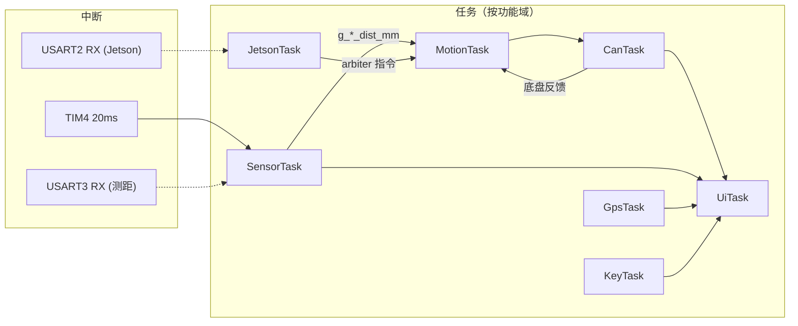

# RTOS 移植路线图

本文档描述将麒麟 F407 综合实验程序从裸机 `while(1)` 迁移到 **FreeRTOS** 的分阶段执行计划。

> 工程现状：SPL 标准库、无 HAL；`SysTick.c` 忙等 `delay_ms`；`TIM4` 20ms 驱动 `OSTime++` 与测距触发。

---

## 阶段 0：FreeRTOS 移植 ✅ 已完成

### 目标

```
├─ 添加 FreeRTOS 源码到 Middlewares/FreeRTOS/
├─ 写 FreeRTOSConfig.h（tick=1000Hz，优先级 7，heap 8KB）
├─ SysTick 交给 FreeRTOS（SVC/PendSV/SysTick 由 port 提供）
├─ delay_ms 改造：调度器未启动用原忙等，已启动用 vTaskDelay
├─ main.c：保留所有初始化 + 创建 TestTask（LED 闪）+ 启动调度器
└─ 验证：LED 500ms 闪 + 串口 printf 正常
```

### 实际改动文件


| 文件                            | 改动                                 |
| ----------------------------- | ---------------------------------- |
| `Middlewares/FreeRTOS/`       | 内核源码（tasks/list/queue/heap_4/port） |
| `User/FreeRTOSConfig.h`       | 内核配置                               |
| `APP/freertos/freertos_app.c` | TestTask + `RTOS_AppStart()`       |
| `Public/SysTick.c`            | `delay_ms` RTOS 包装                 |
| `User/stm32f4xx_it.c`         | 删除空的 SVC/PendSV/SysTick            |
| `User/main.c`                 | `while(1)` → `RTOS_AppStart()`     |
| `Template.uvprojx`            | 新增 FreeRTOS 源文件组与 include 路径       |


### 编译与运行中遇到的问题


| #   | 现象                                                   | 原因                                | 处理                                                             |
| --- | ---------------------------------------------------- | --------------------------------- | -------------------------------------------------------------- |
| 1   | `curl` 下载 FreeRTOS zip 失败（exit 56）                   | 网络中断                              | 改用 jsDelivr CDN 按文件下载                                          |
| 2   | `tasks.c: cannot open "timers.h"`                    | 只下了部分头文件                          | 补下 `include/timers.h`（`configUSE_TIMERS=0` 仍被 tasks.c include） |
| 3   | `SysTick.c` #268 声明在可执行语句后                           | Keil ARMCC 默认 C89                 | `repeat`/`remain` 移到函数块开头                                      |
| 4   | `LED1 = !LED1` 编译报错                                  | `PFout(9)` 位带宏不支持 `!` 赋值          | 改为 `LED1_PORT->ODR ^= LED1_PIN`                                |
| 5   | `paint_app.c` / `wireless_app.c` 字符串乱码               | 源文件编码损坏（与 RTOS 无关）                | 按钮 caption 改为 `"Clear"`                                        |
| 6   | 链接 undefined `vTaskDelay` / `xTaskGetSchedulerState` | FreeRTOS v10.6 默认 `INCLUDE_* = 0` | 在 `FreeRTOSConfig.h` 显式设为 1                                    |
| 7   | 链接 L6406E RAM 溢出                                     | 32KB heap 叠加原有 lwIP/GUI 缓冲        | 阶段 0 暂用 **8KB heap**；阶段 1 再评估                                  |
| 8   | `stm32f4xx_it.c` 空 SVC/PendSV 覆盖 port                | 模板文件与 FreeRTOS 冲突                 | 删除 it.c 中三个空 Handler，用 Config 宏别名                              |


### 配置要点

- 「优先级 7」指 `configMAX_PRIORITIES 7`
- 本工程无 HAL，**不需要** TIM7；SysTick 交给 FreeRTOS
- `delay_ms` 判断：`xTaskGetSchedulerState() != taskSCHEDULER_NOT_STARTED`
- **不要**在调度器启动后的任务/中断里调用 `delay_us` / `delay_nms`（它们直接操作 SysTick 寄存器）

### 验证结果（2026-05-28）

串口输出：

```
[BOOT] UI_MODE=1 (arbiter_gui)
...
[RTOS] Starting scheduler (Phase 0)
[RTOS] TestTask running, LED1 500ms blink
```

板载 LED：**DS0 红光 500ms 闪烁**（PF9 / LED1），**DS1 绿光常亮**（PF10 / LED2，初始化点亮后未改）。符合阶段 0 预期。

---

## 阶段 1：按功能域拆分任务 ✅ 已实现

### 设计原则

**一个 Task 只负责一类功能**，不要把「按键 + GPS + Jetson + CAN + 测距 + 运动 + LCD」按「控制 vs 显示」两大坨硬塞进去。


| 原则          | 说明                                                      |
| ----------- | ------------------------------------------------------- |
| **功能内聚**    | Jetson 通信用 JetsonTask，测距用 SensorTask，LCD 用 UiTask       |
| **数据单向**    | 传感器 Task 写全局量 → 运动 Task 读；UI Task 只读、只画                 |
| **周期匹配**    | 10ms 控制环、20ms Jetson 上行、100ms 显示，各 Task 自带 `vTaskDelay` |
| **ISR 保持瘦** | TIM4 只做协议 tick / 蜂鸣时序；业务逻辑进 Task                        |


**Task 与文件**：运行时 **7 个 Task、一 Task 一职责**；源码 **合并为 `rtos_tasks.c/h` 一个文件**，命名仍遵循 FreeRTOS 风格（见 §1.1）。

### 文件组织

```
APP/freertos/
├── rtos_config.h          // CREATE_TASK、RTOS_PRINT、RTOS_DEBUG_ENABLE
├── rtos_debug.c/h         // RTOS_PrintTaskStackWatermarks
├── rtos_tasks.c/h         // 7 个 Task：vMotionTask … vUiTask（单文件）
├── app_boot.c/h           // 调度器前外设 Init / LCD 占位
├── freertos_app.c/h       // App_SharedInit、App_TasksCreate、RTOS_AppStart
├── freertos_heap.c        // CCM ucHeap
├── motion_ui_shared.c/h   // 距离快照、脏标志、xArbMutex
├── motion_control.c/h     // 运动 / 按键 / 蜂鸣逻辑
└── sensor_ui.c/h          // LCD 绘制（UiTask 专用）
```


| 文件                   | 内容                                            |
| -------------------- | --------------------------------------------- |
| `rtos_tasks.c`       | 全部 7 个 `vXxxTask`、句柄 `xXxxTaskHandle`、周期宏     |
| `motion_ui_shared.c` | 距离快照、`g_*` 脏标志、`xArbMutex`                    |
| `freertos_app.c`     | `CREATE_TASK` 创建 7 Task、`vTaskStartScheduler` |


### §1.1 RTOS 代码风格规范


| 项      | 规范                            | 示例                                   |
| ------ | ----------------------------- | ------------------------------------ |
| 任务函数   | `v` + 功能名 + `Task`            | `vMotionTask`                        |
| 任务句柄   | `x` + 功能名 + `TaskHandle`      | `xMotionTaskHandle`                  |
| 互斥锁    | `x` + 功能名 + `Mutex`           | `xArbMutex`                          |
| 周期宏    | 全大写 + `_CYCLE_MS`             | `MOTION_TASK_CYCLE_MS`               |
| 任务私有变量 | `static` + `s_` 前缀            | `static u8 s_tx_toggle`              |
| 周期等待   | 循环开头 `vTaskDelayUntil`        | 见各 `*_task.c`                        |
| 调试打印   | `RTOS_PRINT`（`rtos_config.h`） | `#define RTOS_DEBUG_ENABLE 1`        |
| 任务创建   | `CREATE_TASK` 宏               | `freertos_app.c` → `App_TasksCreate` |
| 头文件守卫  | `#ifndef __XXX_H`             | `__MOTION_TASK_H`                    |


任务标准模板：

```c
void vMotionTask(void *pvParameters)
{
    TickType_t xLastWakeTime = xTaskGetTickCount();

    for (;;)
    {
        vTaskDelayUntil(&xLastWakeTime, pdMS_TO_TICKS(MOTION_TASK_CYCLE_MS));
        /* 任务主体 */
    }
}
```

> **一句话**：命名统一加前缀，周期用宏不硬编码，私有变量加 static，句柄 extern 供调试/栈监控用。

### 目标概览

```
├─ 删除 TestTask
├─ 按下方 7 个 Task 创建（`App_TasksCreate` + `CREATE_TASK`）
├─ TIM4 中断：保留 OSTime++ + DistanceSensor_Process + BEEP_Process
├─ 原 SensorData_ShowScreen() 按功能拆到对应 Task，删除该大函数
├─ 跨 Task 共享：g_*_dist_mm 临界区保护；arb_state 互斥量（阶段 1 即引入，阶段 2 再队列化 ISR）
└─ 验证：各外设行为与裸机一致 + 下节检查清单
```

### 运行时架构




### 任务一览（一 Task 一职责）

> FreeRTOS：**数字越大优先级越高**；`configMAX_PRIORITIES = 7`，应用任务用 2~6，Idle 占 0。


| Task           | 优先级   | 周期          | 栈    | **唯一职责**                                                    |
| -------------- | ----- | ----------- | ---- | ----------------------------------------------------------- |
| **MotionTask** | **6** | 10ms        | 384w | **仅** `MotionControl_Run()`：读距离 → 仲裁 → CAN TX               |
| **CanTask**    | **5** | 10ms        | 384w | **仅** CAN RX：`Arbiter_ProcessCANFeedback`；置 `g_can_lcd_due` |
| **SensorTask** | **4** | 10ms        | 384w | **仅** 测距：`NewData` → 快照 / 蜂鸣；`Notify` 唤醒 UiTask             |
| **KeyTask**    | **4** | 20ms        | 256w | **仅** 按键：`MotionControl_KeyProcess()`                       |
| **JetsonTask** | **3** | 20ms        | 384w | **仅** Jetson 收发 + V3 上行                                     |
| **UiTask**     | **3** | Notify+50ms | 768w | LCD；`DrainLog` / 分频 `DistanceSensor_Print`；栈水位打印            |
| **GpsTask**    | **2** | 100ms       | 512w | **仅** GPS：`GPS_Process()`；CAN 模式下 `JetsonCAN_SendGps()` |
| IdleTask       | 0     | —           | 128w | 内核内置                                                        |


周期任务使用 `**vTaskDelayUntil`**（UiTask 除外：测距帧 `TaskNotify` 唤醒 + 50ms 兜底）。

上电后每 **5s** 串口打印各 Task 栈余量：`[RTOS] Motion stack free: … w`（`RTOS_PrintTaskStackWatermarks()`）。

#### 优先级分层


| 层级  | 任务                   | 理由                    |
| --- | -------------------- | --------------------- |
| 最高  | MotionTask           | 先算控制、发 CAN，再处理反馈      |
| 高   | CanTask              | 紧随运动控制，排空 RX FIFO     |
| 中高  | SensorTask / KeyTask | 测距与按键同级；按键可被同优先级时间片调度 |
| 中   | JetsonTask / UiTask  | 通信与显示，不阻塞 10ms 控制环    |
| 低   | GpsTask              | 100ms，最低应用优先级         |


控制链顺序：**Motion(6) 发令 → Can(5) 收反馈 → Sensor(4) 采距离**。

### 数据同步（阶段 1 必做）


| 场景                                        | 风险    | 方案                                                        |
| ----------------------------------------- | ----- | --------------------------------------------------------- |
| SensorTask 写 / MotionTask 读 `g_*_dist_mm` | 半更新   | `taskENTER_CRITICAL` / `taskEXIT_CRITICAL`                |
| Can/Jetson/Key/Motion 写 / 读 `arb_state`   | 结构体撕裂 | `xArbMutex` + `App_ArbiterLock()` / `App_ArbiterUnlock()` |
| 脏标志 `g_sensor_updated` 等                  | 一般安全  | `volatile`；LCD 侧读 `DistanceSensor_GetData()` 或快照          |


```c
void DistSnapshot_Write(u16 f, u16 b, u16 l, u16 r, u16 n)
{
    taskENTER_CRITICAL();
    g_front_dist_mm = f;  g_back_dist_mm  = b;
    g_left_dist_mm  = l;  g_right_dist_mm = r;
    g_nearest_dist_mm = n;
    taskEXIT_CRITICAL();
}
```

阶段 2 再 ISR 队列化；互斥量继续保护 `arb_state`。

### 可靠性补充（阶段 1）


| 项             | 文档设计                                      | 代码现状                                |
| ------------- | ----------------------------------------- | ----------------------------------- |
| 栈溢出           | `configCHECK_FOR_STACK_OVERFLOW 2` + Hook | ✅ `freertos_app.c` 已实现              |
| 看门狗 Idle Hook | `configUSE_IDLE_HOOK` 喂 IWDG              | ❌ `configUSE_IDLE_HOOK = 0`，未接 IWDG |
| 栈监控           | `uxTaskGetStackHighWaterMark`             | ✅ UiTask 每 5s 打印各 Task 栈余量          |
| printf 互斥     | `fputc` + `Usart_PrintLock`               | ✅ 调度器启动后多 Task 串口输出加锁               |
| heap          | 32KB @ CCM                                | ✅ 见 §2.1                            |


### 启动顺序

```
main()
  → Hardware_Check()              // 完整 PRECHIN 自检（见下「Flash Fat 策略」）
  → [MEM 打印]
  → App_MotionHwInit()            // Jetson/GPS/测距/CAN/Arbiter（调度器前）
  → App_ShowBootSplash()          // LCD 占位 "System Ready"（调度器前）
  → RTOS_AppStart()
        App_SharedInit()          // Usart_PrintMutexInit + xArbMutex
        App_TasksCreate()         // 7 个 Task
        vTaskStartScheduler()
  → UiTask 首次运行               // SensorUI_DrawStatic 接管 LCD 刷新
```

**分工原则**：LCD `TFTLCD_Init` 在 `Hardware_Check`；占位画面在 `App_ShowBootSplash`；**调度器启动后仅 UiTask 操作 LCD**。外设 Init 与 `delay_ms` 只在调度器**之前**使用（Task 内 `delay_ms` 走 `vTaskDelay`）。

#### PRECHIN 自检与 Flash Fat

所有 `UI_TEST_MODE` **统一行为**：Flash `1:` 挂载/格式化失败 → `Flash Fat Error!` 红字死循环，不区分 arbiter / legacy。

**自动修复流程**：无文件系统 → `f_mkfs` → `f_setlabel` → `**f_mount` 重新挂载** → `fatfs_getfree`（旧代码缺 remount，格式化成功仍误报 Error）。

**仍失败时排查**：

1. 看串口 `[FAT] mkfs 1: failed, err=xx`
2. 确认 W25Q128 硬件 OK（PRECHIN Ex Flash 项）
3. 上电 **KEY_UP** 可擦除 SPI Flash 后重启再格式化
4. 插 SD 卡完成字库/资源更新时顺带修复 `1:` 分区

**字库**在 SPI Flash **12MB 以后**（`FONTINFOADDR`），与 FatFS 前 12MB 分区独立。

### 代码结构


| 路径                                  | 职责                                                                                        |
| ----------------------------------- | ----------------------------------------------------------------------------------------- |
| `APP/freertos/app_boot.c/h`         | `App_MotionHwInit()`、`App_ShowBootSplash()`                                               |
| `APP/freertos/freertos_app.c`       | `App_SharedInit()`、`App_TasksCreate()`、`RTOS_AppStart()`、栈溢出 Hook                         |
| `APP/freertos/freertos_heap.c`      | CCM `ucHeap[]`                                                                            |
| `APP/freertos/rtos_tasks.c/h`       | **7 个 Task**（单文件）：`vMotionTask` … `vUiTask`                                               |
| `APP/freertos/rtos_config.h`        | `CREATE_TASK`、`RTOS_PRINT`                                                                |
| `APP/freertos/rtos_debug.c/h`       | 栈水位打印                                                                                     |
| `APP/freertos/motion_ui_shared.c/h` | 距离快照、`g_*_dist_mm`、`g_*_dirty`、`xArbMutex`                                                |
| `APP/freertos/motion_control.c/h`   | `MotionControl_Run()`、`MotionControl_KeyProcess()`、`MotionControl_BeepUpdateByDistance()` |
| `APP/freertos/sensor_ui.c/h`        | LCD（`SensorUI_`*、`Chassis_UpdateOnLCD`）                                                   |
| `Public/usart.c`                    | `fputc` + `Usart_PrintMutexInit/Lock/Unlock`                                              |
| `User/main.c`                       | `Hardware_Check` → `App_MotionHwInit` → `App_ShowBootSplash` → `RTOS_AppStart`            |


### 数据流（解耦后）

```
测距 UART ISR ──组帧──► DistanceSensor_Process (TIM4)
                              │
                         SensorTask ──写──► g_*_dist_mm（DistSnapshot_Write）
                              │                    │
                              │                    ├──► MotionTask ──MotionControl_Run()──► CAN TX
                              │                    │
                              └── g_sensor_updated ├──► UiTask ──► LCD 测距区
                              └── MotionControl_BeepUpdateByDistance ──► BEEP_Process (TIM4)

Jetson USART2 ISR ──组帧──► JetsonTask ──ParseJetsonCmd──► arb_state ──► MotionTask

CAN RX ──► CanTask ──ProcessCANFeedback──► arb_state / g_can_lcd_due ──► UiTask 底盘区

KeyTask ──MotionControl_KeyProcess──► KEY0 强制停止 / KEY1 蜂鸣开关 ──► g_beep_ui_dirty 等 ──► UiTask

GpsTask ──► GPS_Process + JetsonCAN_SendGps(0x104~0x106) / GPS_PrintStatus
```

---

### 各 Task 执行流程

#### SensorTask（10ms）— `rtos_tasks.c`

```
for (;;)
    vTaskDelayUntil(10ms)
    if (DistanceSensor_NewData() && valid)
        DistSnapshot_Write(...)
        MotionControl_BeepUpdateByDistance(nearest)
        g_sensor_updated = 1
        MotionUI_NotifySensorFrame()
```

#### MotionTask（10ms）— `rtos_tasks.c`

```
for (;;)
    vTaskDelayUntil(10ms)
    MotionControl_Run()
```

#### CanTask（10ms）— `rtos_tasks.c`

```
for (;;)
    vTaskDelayUntil(10ms)
    while (CAN_MessagePending) { ... ProcessCANFeedback ... }
    if (can_updated && ++div >= UI_CAN_LCD_DIV) g_can_lcd_due = 1
```

#### JetsonTask（20ms）— `rtos_tasks.c`

```
for (;;)
    vTaskDelayUntil(20ms)
    GetJetsonFrame → ParseJetsonCmd
    交替 SendV3StatusFrame / SendV3DetailFrame
```

#### KeyTask（20ms）— `rtos_tasks.c`

```
for (;;)
    vTaskDelayUntil(20ms)
    MotionControl_KeyProcess()
```

#### GpsTask（100ms）— `rtos_tasks.c`

```
for (;;)
    vTaskDelayUntil(100ms)
    GPS_Process(); GPS_PrintStatus()
```

#### UiTask — `rtos_tasks.c`

```
for (;;)
    ulTaskNotifyTake(50ms)   // 测距帧 Notify 唤醒
    SensorUI_* / Chassis_UpdateOnLCD
    DistanceSensor_DrainLog / Print（500ms）
    RTOS_PrintTaskStackWatermarks（5s）
```

---

### 阶段 1 细节确认

#### §2.1 RAM 布局与占用（当前）

STM32F407 本工程用到三块 RAM：**片内主 SRAM 128KB**、**CCM 64KB**、**外扩 SRAM 1MB**（FSMC @ `0x68000000`）。

##### 总览


| 物理区域     | 容量    | 链接/配置占用            | 空闲（估）     |
| -------- | ----- | ------------------ | --------- |
| 片内主 SRAM | 128KB | ~48KB              | **~80KB** |
| CCM      | 64KB  | ~49KB              | **~15KB** |
| 外扩 SRAM  | 1MB   | 960KB 池 + 60KB 管理表 | 运行时按需分配   |


配置宏见 `Malloc/malloc.h`；FreeRTOS 堆见 `User/FreeRTOSConfig.h`、`APP/freertos/freertos_heap.c`。

##### 片内主 SRAM（`0x20000000`，128KB）


| 块                            | 大小       | 说明                                                  |
| ---------------------------- | -------- | --------------------------------------------------- |
| 系统 `.bss` / `.data`          | ~14KB    | GPS、CAN、arbiter、Flash/SDIO 缓冲、FreeRTOS 内核变量等（链接时固定） |
| **mem1 池** `mem1base[]`      | **32KB** | `mymalloc(SRAMIN, …)` 动态堆                           |
| **mem1 管理表** `mem1mapbase[]` | **2KB**  | mem1 分配位图（`MEM1_MAX_SIZE / 32 × 2` 字节）              |


**mem1 当前实际分配**（`UI_TEST_MODE=1`，启动后）：


| 调用方                   | 约占用  | 生命周期                                     |
| --------------------- | ---- | ---------------------------------------- |
| `FATFS_Init()`        | ~3KB | 2×`FATFS` + 2×`FIL` + 512B `fatbuf`，常驻   |
| 其余 `mymalloc(SRAMIN)` | 极少   | arbiter 路径不启 lwIP / 以太网 / legacy GUI App |


启动后串口打印（`main.c`）：

```
[MEM] pool IN=…% EX=…% CCM=…% (mem1=32KB mem2=960KB heap=32KB)
```

`UI_TEST_MODE=1` 下 `IN` 通常 **<15%**。

**mem1 用途约定**（`UI_TEST_MODE=1` + 后续 WiFi）：


| 用途                               | 分配方式                         |
| -------------------------------- | ---------------------------- |
| FatFS 小对象、WiFi AT 小缓冲（≤2KB 级）    | `mymalloc(SRAMIN, …)`        |
| WiFi 大 payload、日志 ring、文件读写大 buf | `mymalloc(SRAMEX, …)` → mem2 |


##### 外扩 SRAM（`0x68000000`）


| 块                            | 地址           | 大小        | 说明                    |
| ---------------------------- | ------------ | --------- | --------------------- |
| **mem2 池** `mem2base[]`      | `0x68000000` | **960KB** | `mymalloc(SRAMEX, …)` |
| **mem2 管理表** `mem2mapbase[]` | `0x680F0000` | **60KB**  | mem2 分配位图             |


`UI_TEST_MODE=1` 下 mem2 **几乎未用**（legacy GUI 相机/JPEG 等未运行）。后续 WiFi、日志、大缓冲优先放 mem2。

##### CCM（`0x10000000`，64KB，仅 CPU 可访问，不可 DMA）


| 块                            | 地址           | 大小       | 说明                                            |
| ---------------------------- | ------------ | -------- | --------------------------------------------- |
| **mem3 池** `mem3base[]`      | `0x10000000` | **16KB** | `mymalloc(SRAMCCM, …)`                        |
| **mem3 管理表** `mem3mapbase[]` | `0x10004000` | **1KB**  | mem3 分配位图                                     |
| **ucHeap**                   | `0x10004400` | **32KB** | FreeRTOS `heap_4`：`xTaskCreate` 栈、TCB、Mutex 等 |


`ucHeap` 基址由 `freertos_heap.c` 按 `MEM3_MAX_SIZE` 自动计算；`configAPPLICATION_ALLOCATED_HEAP = 1`。

**ucHeap 静态预算**（7 Task + 互斥量）：


| 项目                               | 约占用              |
| -------------------------------- | ---------------- |
| Task 栈（384w×5 + 256w×1 + 512w×1） | ~10.5KB          |
| TCB × 7                          | ~0.7KB           |
| `arb_mutex` 等内核对象                | <1KB             |
| **合计**                           | **~12KB / 32KB** |


CCM 余量 ~15KB：可增大 `FREERTOS_HEAP_BYTES` 或保留作扩展。

##### 三池对照


| 宏         | 池      | 物理位置     | 配置大小  | 主要用途                     |
| --------- | ------ | -------- | ----- | ------------------------ |
| `SRAMIN`  | mem1   | 片内主 SRAM | 32KB  | FatFS 常驻、片内小对象           |
| `SRAMEX`  | mem2   | 外扩 SRAM  | 960KB | WiFi/日志/大缓冲（后续）          |
| `SRAMCCM` | mem3   | CCM      | 16KB  | 可选 CCM 小分配（arbiter 基本不用） |
| —         | ucHeap | CCM      | 32KB  | FreeRTOS 内核堆             |


##### 相关源文件


| 文件                             | 内容                           |
| ------------------------------ | ---------------------------- |
| `Malloc/malloc.h`              | `MEM1/2/3_MAX_SIZE`          |
| `Malloc/malloc.c`              | 三池 `mem*base[]`、管理表          |
| `APP/freertos/freertos_heap.c` | `ucHeap[]` @ CCM             |
| `User/FreeRTOSConfig.h`        | `FREERTOS_HEAP_BYTES = 32KB` |
| `User/main.c`                  | 启动打印 `[MEM] pool …`          |


##### 调优入口


| 需求            | 改哪里                                                    |
| ------------- | ------------------------------------------------------ |
| 加大 FreeRTOS 堆 | `FREERTOS_HEAP_BYTES`；可减小 `MEM3_MAX_SIZE`，CCM 合计 ≤64KB |
| 加大片内动态堆       | `MEM1_MAX_SIZE`（当前 32KB，含 WiFi AT 余量）                  |
| 加大外扩可用空间      | `MEM2_MAX_SIZE`（当前 960KB）                              |
| 查看 Task 栈余量   | `uxTaskGetStackHighWaterMark()`                        |
| 查看三池使用率       | `my_mem_perused(SRAMIN/SRAMEX/SRAMCCM)`                |


#### §2.2 蜂鸣

- **SensorTask**：`MotionControl_BeepUpdateByDistance()`（有新测距数据时）
- **MotionTask / KeyTask**：不直接改距离蜂鸣策略（KeyTask 可关 `g_beep_dist_enable`）
- **TIM4**：`BEEP_Process()` 硬件时序

#### §2.3 `DistanceSensor_Print` 分频

在 **SensorTask**，每 **50 次循环 ≈ 500ms** 一次。

#### §2.4 可选补充（非必须）


| 补充项                    | 作用              | 阶段      |
| ---------------------- | --------------- | ------- |
| `vTaskGetRunTimeStats` | 查看各 Task CPU 占用 | 调试期可选   |
| Task Notification      | 替代部分脏标志轮询       | 阶段 2 可选 |
| ISR + 队列               | UART 帧直接入队      | 阶段 2 必做 |


---

### TIM4 中断（阶段 1 不改）

```
TIM4_IRQHandler (20ms)
    ├─ OSTime++
    ├─ DistanceSensor_Process()    // 协议状态机，不做 NewData 业务
    └─ BEEP_Process()              // 蜂鸣器硬件时序
```

---

### 代码改动计划（已完成）


| 步骤  | 状态  | 操作                                                |
| --- | --- | ------------------------------------------------- |
| 1   | ✅   | `rtos_tasks.c`：七个 Task（FreeRTOS 命名，单文件）           |
| 2   | ✅   | `motion_ui_shared`、`motion_control`、`sensor_ui`   |
| 3   | ✅   | CCM heap 32KB、栈溢出 Hook                            |
| 4   | ✅   | 逻辑从原 `SensorData_ShowScreen()` 拆出；`main.c` 已删除该函数 |
| 5   | ✅   | `RTOS_AppStart()` 一次创建 7 Task                     |
| 6   | 待上板 | `uxTaskGetStackHighWaterMark` 调优                  |


---

### 阶段 1 上板记录（2026-05-28）

#### 编译 / 工程

| 现象 | 原因 | 处理 |
|------|------|------|
| `cannot open "jetson_can.h"` | Keil Include Path 缺 `APP\jetson_can` | `Template.uvprojx` 已补 |
| `JETSON_CAN_ID_STATUS` 未定义（`JETSON_LINK_CAN=0`） | `can2.h` 仅在 CAN 宏内包含 | `usart3.c` 始终 `#include "can2.h"` |

#### Flash Fat 自检

| 串口 | 含义 |
|------|------|
| `[FAT] 1: getfree err=13` | FatFs **FR_NO_FILESYSTEM**（`1:` 无有效 FAT） |
| `[FAT] mkfs 1: failed, err=12` | **FR_NOT_ENABLED** — 曾 `f_mount(NULL,"1:",0)` 卸载后再 mkfs，工作区丢失 |
| `[FAT] … (arbiter skip, …)` | `UI_TEST_MODE=1` **不卡死**，Flash Disk 行显示 **SKIP** |

**说明**：运动仲裁 **不依赖** SPI Flash 前 12MB 的 Fat 分区；字库在 **12MB 以后** 直读 EN25Q128（`font_init()`）。  
**修复**：`getfree` 失败时 **保持** `f_mount(fs[1],"1:",1)` 再 `f_mkfs`；仍失败则 SKIP 继续启动。  
**可选恢复**：上电按住 **KEY_UP** 擦除 SPI Flash；或插 SD 卡更新资源。

`EN25QXX_TYPE=FFFF` 偶发为 SPI 读 ID 时序问题，后续读到 `5217`（W25Q128）即正常。

#### RTOS 首次上电（已通过）

- 串口出现 `[BOOT] UI_MODE=1`、`[RTOS] Creating tasks`、约 5s 后栈水位（Motion ~267w 等）
- 无 Jetson 心跳时 **ARB=DEGRADED** 属预期
- 测距、底盘 CAN、GPS 配置日志正常

#### 已知问题：KEY0 FORCE STOP 无法 OFF（已修）

| 现象 | 原因 |
|------|------|
| 按 KEY0 出现 `[CTRL] FORCE STOP ON`，再按无 `[CTRL] FORCE STOP OFF` | ① `KEY_Scan()` 静态变量 `key` 释放条件含 **KEY_UP==0**，KEY_UP 误读为高则 **key 永不清 1**；② **TIM2 100ms ISR** 内 `KEY_Scan(1)+delay_ms` 与 **KeyTask** 抢同一静态状态 |

**修复**（已合入）：

1. `key.c`：释放判定改为 **KEY0/1/2 均松开** 即可，不依赖 KEY_UP  
2. `app_boot.c`：`App_MotionHwInit()` 内 **关闭 TIM2** 中断（PRECHIN 拍照用，仲裁模式不需要）

**验证**：KEY0 第一次 → `FORCE STOP ON` + LCD `STOP:ON KEY0=resume`；再按 → `FORCE STOP OFF -> Arbiter restart`

#### 阶段 1 验证清单（更新）

**功能**

- [x] RTOS 启动 + 栈水位打印
- [x] 测距 → 运动 / DEGRADED 日志
- [x] CAN 底盘反馈 / 轮速打印
- [x] GPS 配置完成
- [ ] Jetson 下行 / 上行（需接链路）
- [ ] KEY0 STOP ON/OFF _toggle_（待本修复烧录复测）
- [ ] KEY1 蜂鸣开关

**性能 / 可靠性**


| 检查项    | 方法                              | 通过标准                |
| ------ | ------------------------------- | ------------------- |
| 任务是否堆积 | 各 Task 内周期计数 `loop_cnt`，串口每秒打印  | 10ms Task ≈ 100 次/s |
| CAN 丢帧 | 对比裸机 RX 计数                      | 0 额外丢失              |
| 响应延迟   | 测距变化 → CAN 速度帧（逻辑分析仪 / 串口时间戳）   | < 30ms              |
| 栈余量    | `uxTaskGetStackHighWaterMark`   | 剩余 > 20%            |
| CPU 占用 | RunTimeStats 或 GPIO 翻转测 Idle 比例 | < 70%（调试期）          |
| 看门狗    | 故意死循环某 Task                     | IWDG 复位生效           |
| 长时间运行  | 30min 连续                        | 无 HardFault         |


---

## 阶段 1.5（已取消）

原「独立 JetsonTask」已作为 **JetsonTask** 纳入阶段 1 功能解耦方案，不再单独实施。

---

## 阶段 2：Jetson CAN 化 + ISR 队列

| 文档 | 内容 |
|------|------|
| [硬件连接与通信协议.md §2.2](./硬件连接与通信协议.md) | CAN / RS232 **编译切换**与接线 |
| [Jetson_CAN协议.md](./Jetson_CAN协议.md) | CAN2 协议（默认） |
| [Jetson_RS232协议.md](./Jetson_RS232协议.md) | USART2 备用链路 |

```
├─ Jetson 链路：CAN2 PB5/PB6（默认）或 USART2 PA2/PA3；宏 JETSON_LINK_CAN  [软件 ✅]
├─ V3 24B：CAN ID 0x101/0x102/0x103（3×8 分片）或 RS232 整帧              [软件 ✅]
├─ GPS 上行：仅 CAN 模式，ID 0x104~0x106                                   [软件 ✅]
├─ 实现：can2.c + jetson_can.c；RS232 走 usart3.c
├─ 待做：串口 ISR 入队（可选）；Jetson 侧 USB-CAN bridge
└─ 验证：按所选链路解析 V3、心跳 300ms
```

---

## 阶段 3：干掉裸机时间基准

```
├─ 删除全局 OSTime
├─ TIM4 回调删 OSTime++
├─ arbiter.c：ARB_MS_TO_TICKS(ms) 改成 pdMS_TO_TICKS(ms)
├─ 所有 OSTime 比较改成 xTaskGetTickCount()
├─ Log_GetUptimeMs() 改成基于 xTaskGetTickCount()
└─ 验证：心跳 / 恢复时间更准 + 无 OSTime 残留
```

---

## 完成

**完全 RTOS 化**