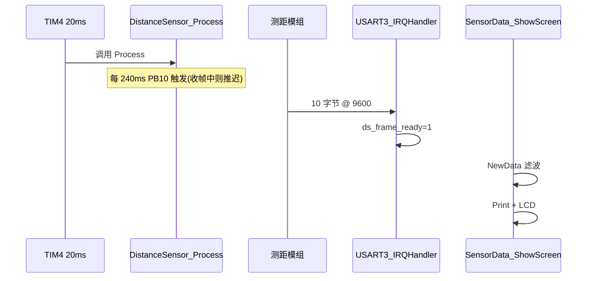

# 测距传感器数据流说明

仅描述 **四路 UART 测距模组**（E08 类）相关：串口、触发、收帧、解析、滤波、串口日志与 LCD 显示。

> 源码：`APP/distance_sensor/distance_sensor.h`、`distance_sensor.c`；主循环显示在 `User/main.c` 的 `SensorData_ShowScreen()`；定时触发在 `APP/time/time.c` 的 TIM4 中断。

---

## 1. 硬件与串口

| 项目 | 说明 |
|------|------|
| 外设 | **USART3** |
| TX / 触发 | **PB10**（平时 UART TX；触发时临时改 GPIO 输出拉低） |
| RX | **PB11**（UART RX，字节中断接收） |
| 波特率 | **9600**，8N1 |
| 调试日志 | **USART1** 115200，`DistanceSensor_Print()` 输出 `[DS]` |

---

## 2. 总体数据流

### 2.0 框图

```text
  TIM4 每 20ms
       |
       v
  DistanceSensor_Process()     每 240ms：PB10 拉低触发测距
       |                       下一拍恢复 UART，等模组回包
       v
  测距模组 UART 发送 10 字节帧
       |
       v
  USART3_IRQHandler (PB11)     组帧、校验、写入 ds_data
       |                       ds_frame_ready = 1
       v
  main: SensorData_ShowScreen()
       |
       +- DistanceSensor_NewData()  -> 滤波
       +- DistanceSensor_Print()     -> USART1 [DS] 日志
       +- SensorUI_UpdateDistances() -> LCD 四路距离
```

### 2.1 文字版（从 main 开始，仅传感器）

**一、初始化（main 里执行一次）**

1. `Hardware_Check()` 中已启动 **TIM4（20ms）**；之后每 20ms 进 `DistanceSensor_Process()`（此时若尚未 Init，Process 几乎无动作）。
2. `DistanceSensor_Init()`：
   - 配置 PB10/PB11 为 USART3，9600；
   - 开 `USART3_IRQHandler` 接收中断；
   - 清空 `ds_rx_idx`、`ds_frame_ready`、`ds_data`，滤波器复位。

**二、背景：TIM4 中断（每 20ms，与 main 并行）**

3. `DistanceSensor_Process()`：
   - **每 240ms**（`12 × 20ms`，E08 轮询整轮约 170~250ms）：
     - 关 RX 中断；
     - PB10 改 GPIO，**拉低**（下降沿触发模组测距）；
     - 下一拍（20ms 后）PB10 恢复 UART，再开 RX 中断；
   - 若已开始收包但 **200ms** 内没收满 10 字节：置 `ds_log_rx_timeout`，主循环会打 `[DS] RX timeout`。

**三、背景：USART3 接收中断**

4. `USART3_IRQHandler()` 每收到 1 字节：
   - 等帧头 `0xFF`，再收满 **10 字节**；
   - 校验：字节 0~8 累加和 & 0xFF == 字节 9；
   - 解析 IF1~IF4 距离（大端 u16，mm）；
   - 异常值打 `error` 并归一化（见第 4 节）；
   - 校验通过：`ds_data.valid = 1`，`ds_frame_ready = 1`。

**四、主循环（SensorData_ShowScreen，约每 10ms）— 与传感器相关的步骤**

5. `DistanceSensor_DrainLog()` — 若有收包超时，USART1 打印 `[DS] RX timeout`。
6. `DistanceSensor_NewData()`：
   - 若 `ds_frame_ready == 0`，直接返回 0（本帧无新数据）；
   - 若为 1：清标志，调用 `DistanceSensor_FilterOnNewFrame()` 做四路滤波，返回 1。
7. **有新帧时**（`sensor_updated == 1`）：
   - `cnt++`；
   - `DistanceSensor_Print()` — USART1 打印每路 IF 原始值 + `Filt F/B/L/R`；
   - `SensorUI_UpdateDistances(ds)` — LCD 刷新四路：`1630 mm (1625)`（原始 + 括号内滤波值）；
   - `SensorUI_UpdateCount(cnt)` — LCD 刷新帧计数。
8. 首次进入界面：`SensorUI_DrawStatic()` 画 IF1 上 / IF2 下 / IF3 左 / IF4 右 标签。

**五、数据在模块内的形态**

```text
模组 UART 帧
    -> USART3_IRQHandler -> ds_data.dist[0..3] + error[0..3]
    -> DistanceSensor_NewData -> 滤波 -> stable_mm[0..3]
    -> GetFilteredMm(i) / GetData()
    -> LCD 与 [DS] 日志
```

---

## 3. UART 帧格式（10 字节）

| 字节 | 含义 |
|------|------|
| 0 | 帧头 `0xFF` |
| 1-2 | IF1 距离 mm（高字节在前） |
| 3-4 | IF2 |
| 5-6 | IF3 |
| 7-8 | IF4 |
| 9 | 校验和 |

---

## 4. 解析与异常值

| 模组原始值 | error | 存入 dist | Print 显示 |
|------------|-------|-----------|------------|
| 30 ~ 59999 | NONE | 原值 mm | `IFx: nnn mm` |
| 0xEEEE | CHKFAIL | 0 | `IFx: CHK ERR` |
| 0xFFFF / 0 / >59999 | TIMEOUT | 0 | `IFx: TIMEOUT` |

> 例如 65533 (0xFFFD) 会判 TIMEOUT，不会当正常距离。

---

## 5. 滤波

在 `DistanceSensor_NewData()` 里，每收到一帧对四路分别滤波：

| 参数 | 值 |
|------|-----|
| 窗口 | 2000 ms，最多 5 个样本 |
| 输出 | 有效样本的**中位数** |
| 有效范围 | 30 ~ 3000 mm |
| 野值 | 相对窗口中位数突跳 > 800 mm 则丢弃该样本 |
| 最少样本 | >=2 用中位数；=1 暂用该点 |

常用读取接口：

| 函数 | 含义 |
|------|------|
| `DistanceSensor_GetData()` | 最新**原始帧**（含 error） |
| `DistanceSensor_GetFilteredMm(i)` | 第 i 路**滤波后**距离 |
| `DistanceSensor_GetFilteredMinDistMm()` | 四路滤波最小值 |
| `DistanceSensor_NormalizedMm(i)` | 单路归一化（供滤波输入） |

---

## 6. 显示与串口日志

### 6.1 IF 与屏幕方位（main.c 宏）

| 索引 | 探头 | 屏幕位置 | Filt 日志 |
|------|------|----------|-----------|
| 0 | IF1 | 上 | F |
| 1 | IF2 | 下 | B |
| 2 | IF3 | 左 | L |
| 3 | IF4 | 右 | R |

### 6.2 LCD

- **Count**：累计收到的新帧次数
- **每路**：`原始 mm (滤波 mm)`，无效时 `0` / `ERR` / `---`

### 6.3 串口示例（USART1，有新帧时）

```text
[T001630] [DS] IF1: 1630 mm
[T001614] [DS] IF2: 1614 mm
[T001614] [DS] IF3: TIMEOUT
[T001721] [DS] IF4: 1721 mm
[T001721] [DS] Filt F=1625 B=1610 L=--- R=1720
---
```

无 `[DS]` 行 = 未收到完整有效 UART 帧（查 PB10/PB11、供电、9600、触发间隔 ≥240ms 且勿在收帧中途触发）。

---

## 7. 时序图



---

## 8. 相关源文件

| 文件 | 传感器相关职责 |
|------|----------------|
| `APP/distance_sensor/distance_sensor.c` | Init、Process、ISR、解析、滤波、Print |
| `APP/distance_sensor/distance_sensor.h` | 帧格式、时序/滤波宏、API |
| `APP/time/time.c` | TIM4 调用 `DistanceSensor_Process()` |
| `User/main.c` | `SensorUI_*`、`SensorData_ShowScreen()` 里调用 NewData/Print/_LCD |

---

## 9. 常见问题（传感器）

| 现象 | 可能原因 |
|------|----------|
| 无 `[DS]` 日志 | 未收满 10 字节帧；接线/波特率/触发周期短于模组整轮(~200ms) |
| Count 不增加 | 同上 |
| 某路常 TIMEOUT | 触发过快打断收帧、该路探头未接/超量程/安装问题 |
| 65533 等怪数 | 实为超量程码，已按 TIMEOUT 处理 |
| LCD 数字不刷新但有 `[DS]` | LCD 驱动问题，与传感器解析无关 |

---

*UTF-8 with BOM。乱码时 Cursor 右下角选 UTF-8 重新打开。*